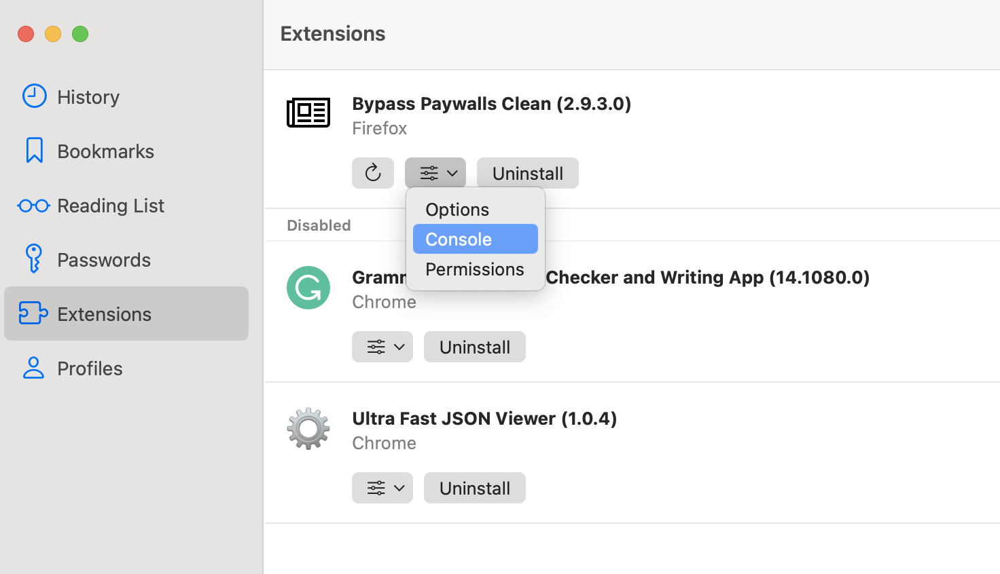

---
next:
  text: 'Troubleshooting Webpage Issues'
  link: '/orion/support-and-community/troubleshooting/troubleshooting-webpage-issues'
---

# Troubleshooting Extension Issues

Orion supports both Chrome and Firefox extensions natively. Note that this support is still experimental
and extensions may break or show unexpected behavior.

We recommend submitting such issues to
[orionfeedback.org](https://orionfeedback.org).

Here are some extra things you can do to help us debug this:

- Copy console errors from background-script [Tools->Extensions->Console (from options popup button for specific web-extension)]

 

- Copy console errors from web-extension popup if applicable
- Copy console errors from current active tab (in case its related to tab communication or content script)
- Store URL for web-extension
- Specify exactly what things are not working
- Provide video or screenshot demonstrating extension working as expected with a chrome of firefox browser

