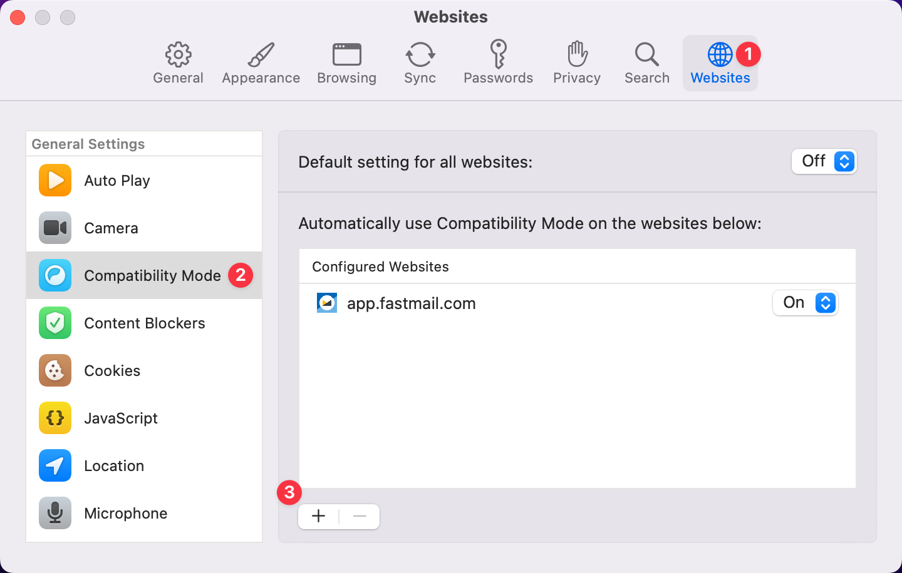
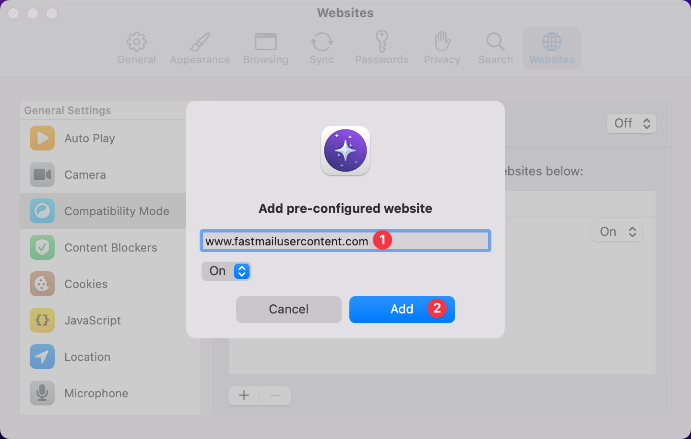
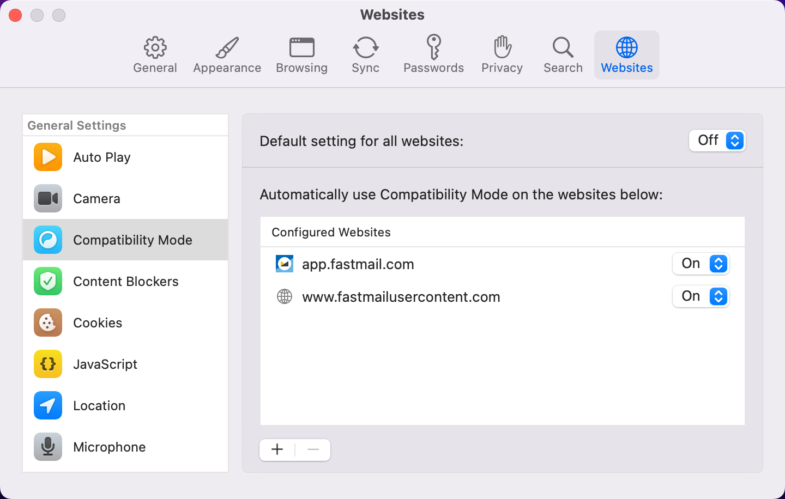

# Fastmail Issues

If you're having trouble using the Fastmail web app in Orion, the steps below may help.

1. Leave the "Keep me logged in" box **unchecked** when logging into the Fastmail web app.

 

2. While viewing the Fastmail web app at [https://app.fastmail.com](https://app.fastmail.com) in Orion, enable [Compatibility Mode](troubleshooting-webpage-issues.md#macos) by using the gear icon on Orion's toolbar:

 

3. Enable Compatibility Mode for **www.fastmailusercontent.com** in Settings:
   1.  Click the **Orion** menu and click **Settings**.
   2.  Click the **Websites** tab.
   3.  Choose **Compatibility Mode** from the list of options.
   4.  Click the **+** icon.
   5.  Type or paste **www.fastmailusercontent.com** into the text field and click **Add**.
   6. You will see the addition reflected in your Settings.

 

 

 
