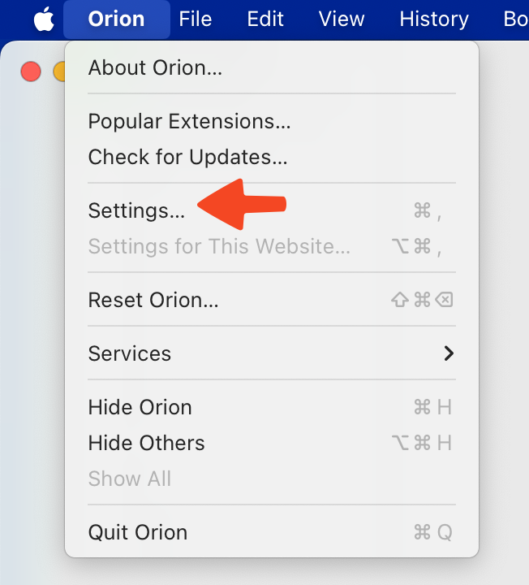

# Troubleshooting Syncing Data Issues

If you have problems syncing between devices try the following in order:

1. Ensure iCloud Drive is On
    - Make sure that iCloud Drive sync is enabled on all of your devices. See [this Apple Support article](https://support.apple.com/en-us/HT204025) for instructions for your device.
1. Toggle Orion in iCloud Settings
    - iOS / iPadOS
        - Open `Settings/Apple ID/iCloud/Apps Using iCloud/Show All` and toggle off and on the button beside Orion
    - MacOS
        - Open `Settings/Apple ID/iCloud/iCloud Drive/Apps Syncing to iCloud Drive - Options` and uncheck and check the box beside Orion
1. Toggle Sync in Settings
    - MacOS
        1. Use the **Orion** menu to open Settings.
         
        1. Click the **Sync** tab and find the box for **Enable cross-device sync of your tabs, bookmarks, and reading list**. Turn it off and then back on.
         
    - iOS / iPadOS
        1. Tap the three-dot menu (•••) in the upper-right corner of the screen.
         
        1. Tap **Settings**.
         
        1. In the **Sync** section, turn Sync off and then back on.
