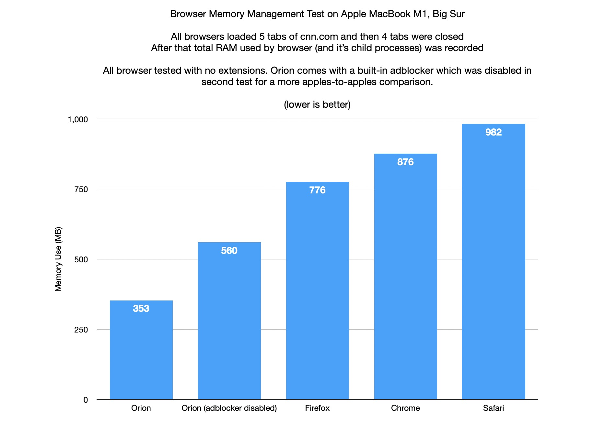

# Memory Usage

Orion is lightweight with advanced memory-use technology. From single-tab optimizations to pinned tab management, we strive to minimize Orion's memory footprint.   

 
  
For power users, Orion has the best closed-tab management of all contemporary browsers. On default settings, Orion will consume 2x-3x less memory than mainstream choices after closing tabs.   

 