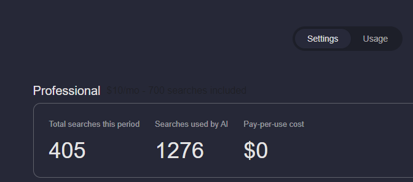

# AI Usage Pricing

AI tools are powerful and are more expensive to run than standard search, therefore we consider the AI tool usage in addition to standard search. Using AI tools will incur additional cost and be treated as search usage according to your Kagi plan. In general, we count 1,000 tokens processed by AI as one search, and tokens are influenced by the size of the AI request submitted.

 In practice, this means that:

* Summarize results will typically use 700-800 tokens, or less than 1 search
* Ask Questions about Document will typically use 500-1000 tokens per question (depending on document size)
* Summarize Page depends on the document size, with maximum processed tokens set to 10,000 even if the page has more than that. 

For example, if you are summarizing an entire book with 100,000 words, it will cost you approximately 10 searches.

## Review AI Usage
You can review your AI usage from within the [Billing settings](https://kagi.com/settings?p=billing) under your Plan Type.

## Legacy Professional Plan 
The Legacy Professional Plan has a limit of 50 monthly interactions with AI. 

## Ultimate Plan
Ultimate plan has a fair use policy of 300 monthly interactions with AI.