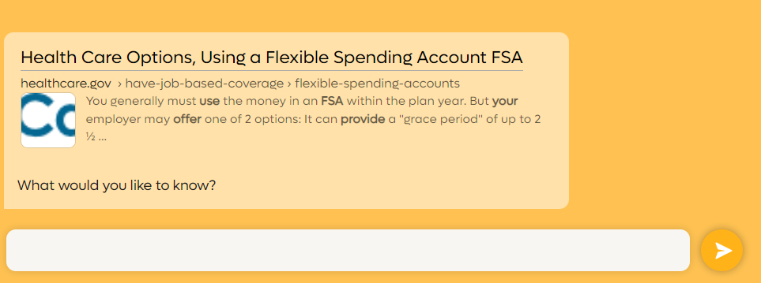
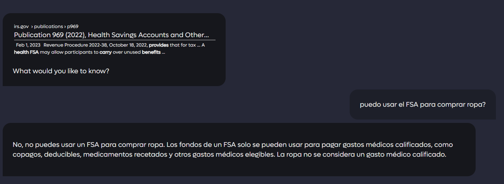

# Ask Questions about Document

Kagi offers the unique ability to Ask Questions about Document for pages that are returned in your search reuslts. This options brings up an interactive chat window where you can ask further questions and Kagi AI will use the document to produce quick and meaningful answers. This option is easily accessible by expanding the options next to a specific web page in the result set. 

Once selected a new window will be opened where you can interact via chat with the desired document.

Then you can ask any question you like! 

You can even ask questions in a different language!

You can close out the discussion by selecting the X in the upper right hand of the window.
