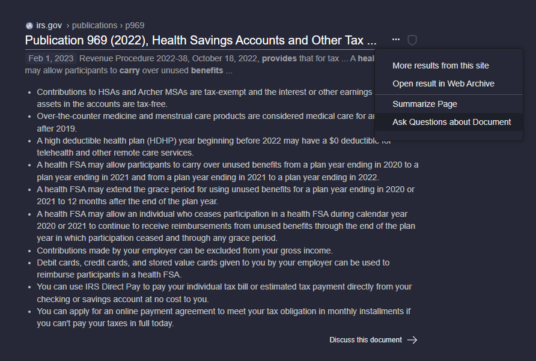
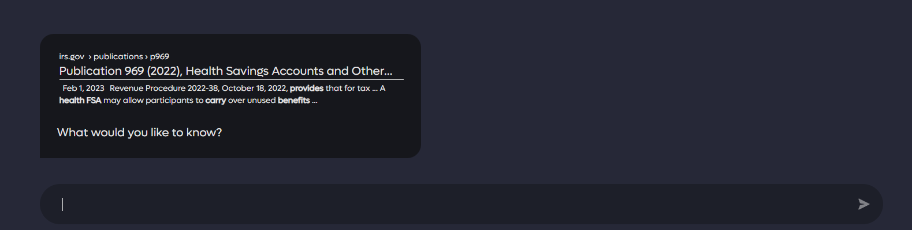
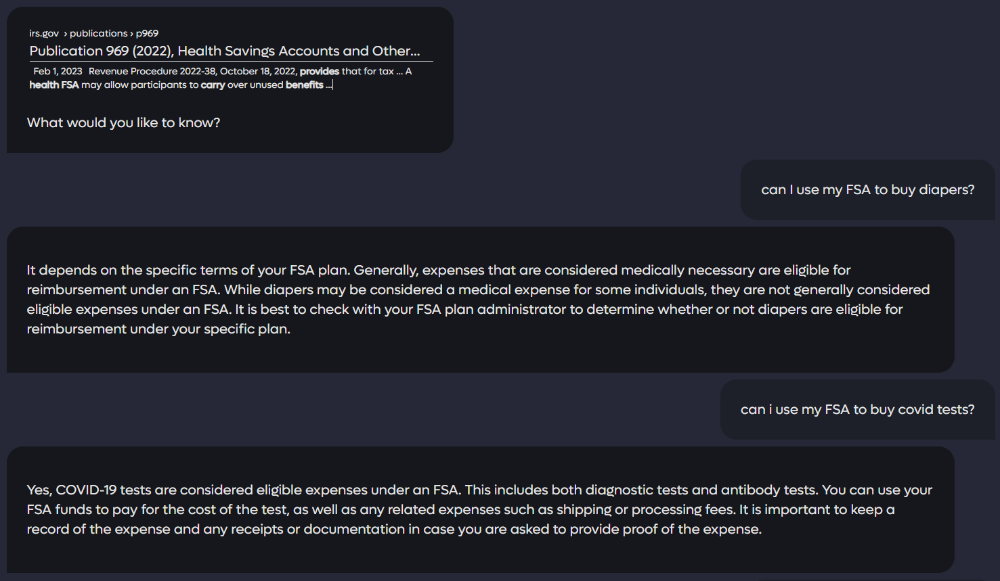

# Discuss

Kagi AI allows you to discuss the result set with an AI model to answer further and more detailed questions pertaining to the results returned by search. This option is easily accessible by expanding the options next to a specific web page in the result set. 

Once selected a new window will be opened where you can interact via chat with the desired document.

Then you can ask any question you like! 

You can close out the discussion by selecting the X in the upper right hand of the window.