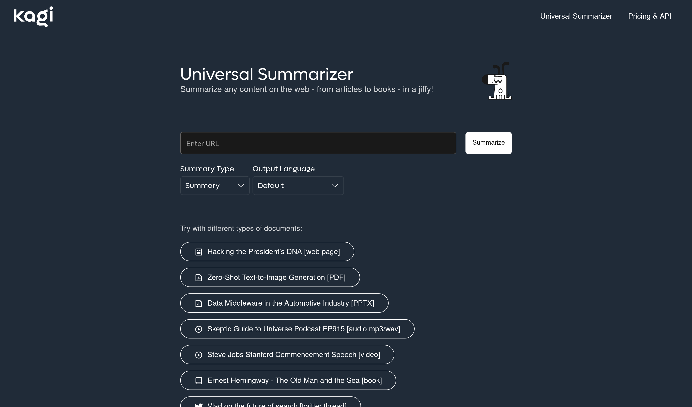

# Summarize Page

There are three ways to summarize a page:

1. Directly in the search results
2. Via bang
3. On a dedicated page, independent of a previous search

## In search results

You may find individual pages that you would like to summarize and Kagi is the first engine to offer a Summarize Page option. Expand the page options next to a search results and select "Summarize Page" and Kagi will use it's proprietary Universal Summarizer technology in the back end to provide an easily digestible synthesis.

Once complete you will see the individual page summary appear below the result.

After reading the summary you can even choose to proceed to [Discuss this document](./ai/discuss.md).

## Via bang

Quickly summarize any page using the [bang `!sum`](../features/bangs.md#universal-summarizer).

## Universal Summarizer landing page

There's <https://kagi.com/summarizer> where you can enter the URL of any page, PDF, PPTX, MP3, video etc that you want to have summarized.

