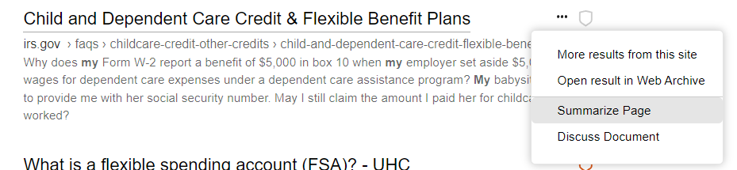

# Summarize Page

You may find individual pages that you would like to summarize and Kagi is the first engine to offer a Summarize Page option. Expand the page options next to a search results and select "Summarize Page" and Kagi will use it's proprietary Universal Summarizer technology in the back end to provide an easily digestible synthesis.

Once complete you will see the individual page summary appear below the result.

After reading the summary you can even choose to proceed to [Discuss this document](./ai/discuss.md)
