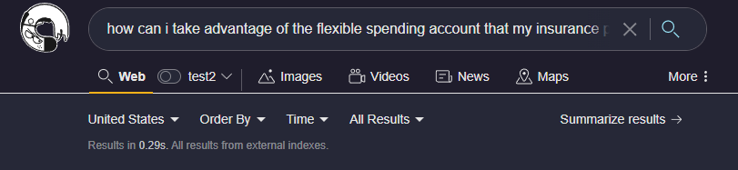

# Summarize Results

Even with an engine as powerful as Kagi you may not be interested in reading every resulting page and want a synthesis of the information as well as references to important pages in the search result. Kagi's Summarize Results quickly produces a summary of the results across the pages returned and provides references to the pages that are used. This functionality allows you to quickly consume the desired information from the search while giving you the pointers to dive deeper into the information if desired. 

Once you have search results returned you can select "Summarize results" to quickly transform the information on the page into the easier to digest format.

The Kagi AI Summarize Results will quickly produce a summary of the results below the search bar.

Kagi AI Summarize Resultsis a new tool and benefits from constant feedback, be sure to use the feedback option to help tune the model for your specific needs.

