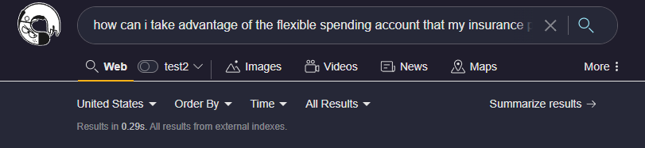

# Universal Summarizer

Whenever you search you can ask Kagi to summarize the collective results for you into a single easily digestable paragraph with references to the individual sites. 

Kagi AI Universal Summarizer will quickly produce a summary of the results below the search bar.

Kagi AI Universal Summarizer is a new tool and benefits from constant feedback, be sure to use the feedback option to help tune the model for your specific needs.

