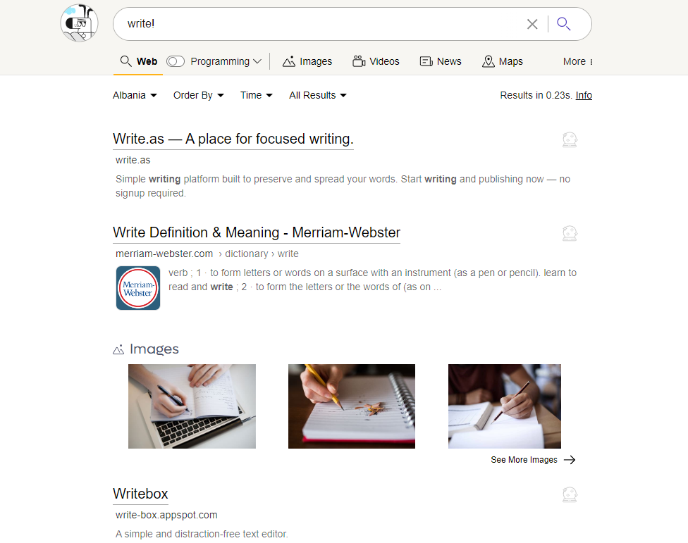
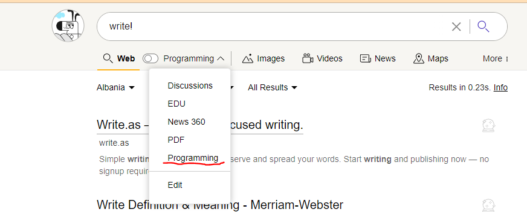
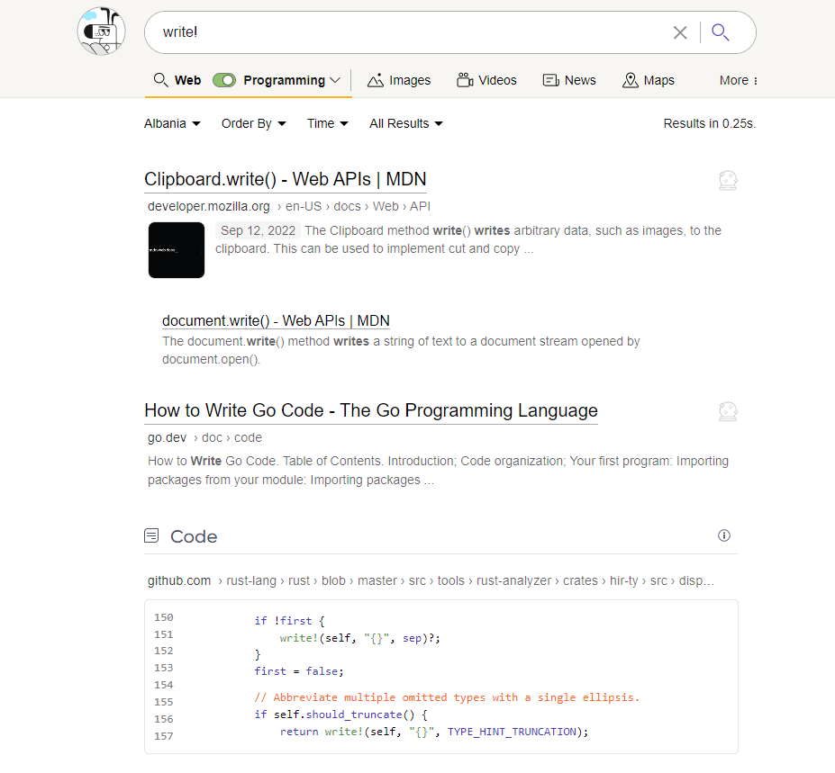

# Code Searching

Kagi supports developers with code samples in response to search results. 

For example, consider searching for <i>write!<i>

The results are not relevant to a developer, however we can further refine our search by applying the "Programming" lens.

Now the results are significantly more relevant to a developer AND now feature code samples.

With Kagi Code Search you can find the code samples you are looking for, even in the depths of GitHub!

Remember to apply the correct lens, or create your own, to help refine your code searches. 