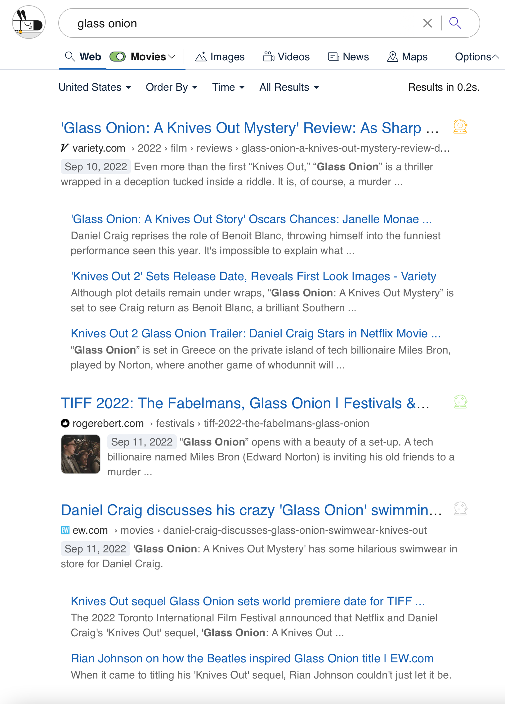

# Lenses

Kagi [Lenses](https://kagi.com/settings?p=lenses) allow you to customize your searches by specifying which websites (and other parameters) you see in your results. We provide a few Lenses to get you started, such as one to search only online discussions and forums.

Here's an example using the built-in EDU lens:

 

You can create your own Lenses where you specify parameters such as:

- Region
- Up to 10 includes websites
- Up to 10 excluded websites
- Up to 5 included keywords
- Up to 5 excluded keywords
- File type
- Results before a given date
- Results after a given date

Lenses do not yet support image or video searches.

## Default Lenses

Kagi offers several prebuilt lenses. The following are available by default:

- **Forums**: search forums from around the Web.
- **Programming**: official programming language websites and forums.
- **World News**: recent information from a selection of global news outlets across the globe.
- **EDU**: searches academic domains.
- **PDF**: search for PDF files.

The following lenses need to be activated from the [Lenses](https://kagi.com/settings?p=lenses) settings.

- **Ad-free**: results that favor noncommercial domains and topics.
- **Recipes**: common sense recipes from sites with no ads.

## Lens Example

Let's say you love movie news and reviews. You can make a Lens that searches only the movie-related websites you find most useful.

1. Go to the [Lenses page](https://kagi.com/settings?p=lenses) and click the **Create New** button at the bottom of the page.
2. Fill in the "Create Lens" page with the details of how you want the Lens to constrain searches. Perhaps you live in the United States and you like certain movie-focused websites.

 

3. Click the **Save** button at the bottom of the page.
4. Back on the Lenses page, switch your new Movies Lens to **On**.

 

5. Do a search in Kagi for a movie title.

 

6. Once you see the search results, enable your Movies Lens.

 

7. You will see the search results constrained to specific websites based on the Lens.

 

Lenses are a powerful tool for making searches more useful. If you think about the types of things you search for often, you can probably create Lenses to make those searches more efficient and effective.
