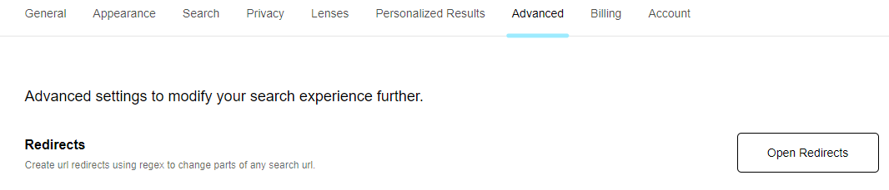
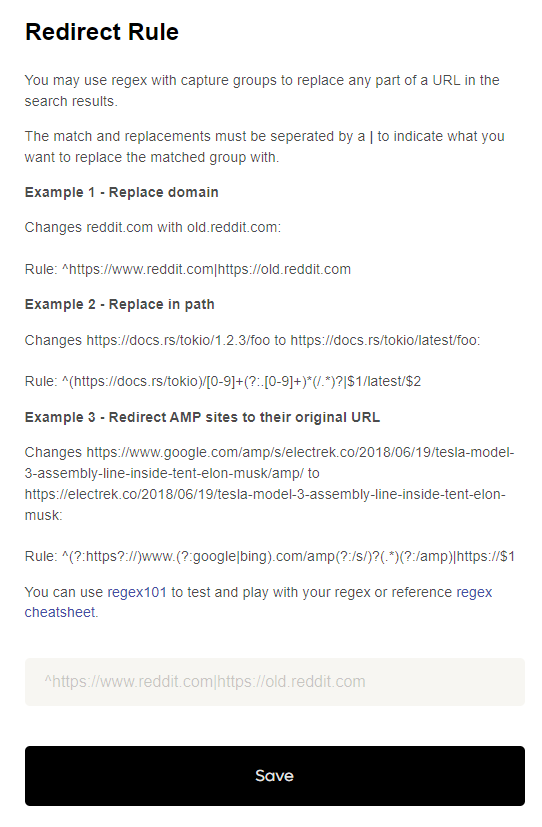

# URL Rewrites (Redirects)
You can use regex to create URL Redirects to change parts of any search URL from within [Advanced Settings](https://kagi.com/settings?p=advanced).

For example you may elect to replace "reddit.com" with "old.reddit.com" in your search results. 

Alternatively you may elect to replace a version number in a document URL with "latest". 

Select "Open Redirects" to see existing Redirect rules and define new ones. 

Select "Add Rule" to define a new rule by following the instructions on the prompt.

