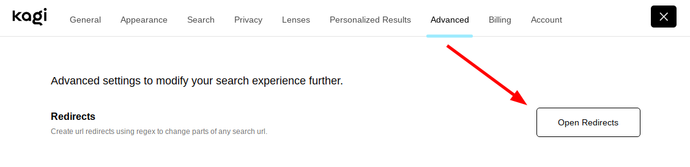
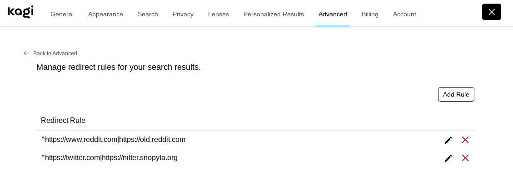

# Redirects (URL Rewrites)

Redirects are a powerful feature that allow you to make modifications to search result URLs with textual find & replace.

Some use cases of redirects include:

- Change domains to a preferred domain (`reddit.com` to `old.reddit.com`)
- Fixing links to outdated documentation with bad SEO 
- Rewriting proxied pages (like Google AMP) to their source URL
- Changing any `http` link to `https`

## Managing Redirects

You can manage redirects in your [Advanced](https://kagi.com/settings?p=advanced) settings menu, under **Redirects**.

This will open the [Redirects Settings Page](https://kagi.com/settings?p=redirects):

To create a new Redirect, press the **Add Rule** button on the [Redirects settings page](https://kagi.com/settings?p=redirects).
This will open a form with instructions and some examples to get you started.

You can edit an existing Redirect by pressing the pencil icon.
<svg width="16" height="16" viewBox="0 0 12 12" fill="none" xmlns="http://www.w3.org/2000/svg">
<path d="M2.32308 7.69082C1.99365 8.02024 1.5857 8.75208 1.22088 9.49619C0.834202 10.2849 1.6146 11.0653 2.40332 10.6786C3.14743 10.3138 3.87927 9.90586 4.2087 9.57644L10.0139 3.77125L8.12826 1.88563L2.32308 7.69082ZM11.578 2.20712C11.7559 2.02928 11.7411 1.72724 11.545 1.53114L10.3684 0.35451C10.1723 0.158406 9.87024 0.143658 9.69239 0.321504L8.59967 1.41423L10.4853 3.29984L11.578 2.20712Z" fill="currentColor"/>
</svg>

You can delete a Redirect by pressing the red <b>X</b>.

## Appearance in Results

Results that have been modified by a redirect will have a 
<svg width="16" height="16" viewBox="0 0 12 12" fill="none" xmlns="http://www.w3.org/2000/svg">
<path d="M2.32308 7.69082C1.99365 8.02024 1.5857 8.75208 1.22088 9.49619C0.834202 10.2849 1.6146 11.0653 2.40332 10.6786C3.14743 10.3138 3.87927 9.90586 4.2087 9.57644L10.0139 3.77125L8.12826 1.88563L2.32308 7.69082ZM11.578 2.20712C11.7559 2.02928 11.7411 1.72724 11.545 1.53114L10.3684 0.35451C10.1723 0.158406 9.87024 0.143658 9.69239 0.321504L8.59967 1.41423L10.4853 3.29984L11.578 2.20712Z" fill="currentColor"/>
</svg>
indicator to show that they were modified by one of your rules.

You can click this icon to open the rule that modified the URL.

By hovering on this icon, a tooltip will appear showing you the original URL.

## Redirect Syntax

A redirect looks like this:

  ^https://reddit.com/|https://old.reddit.com/

It is composed of the following parts:

  ^https://reddit.com/
  |
  https://old.reddit.com/

- The regex match pattern
- A pipe (`|` ) separator character
- The replacement pattern

The match pattern is written using [Regex](https://en.wikipedia.org/wiki/Regular_expression), a standard language for pattern matching sequences of text.

The replacement pattern is a verbatim string that will replace then entire URL.

You can use `$1`, `$2`, and so on in the replacement pattern to refer to *capture groups* in the match pattern, to retain parts of the original URL.
Capture groups in regex are parts of the pattern that are enclosed in parentheses `()`.

For every URL on the page that matches the match pattern, a replacement will be triggered using the replacement pattern.

## Regex Help

If you've never used regex before - and even if you have - regex can be hard to get right!

Here are some resources to help you write and understand regex:

- [Regex 101](https://regex101.com/), a sandbox for writing and testing regex
- [QuickREF.ME - Regex Cheatsheet](https://quickref.me/regex), a quick reference on regex syntax

If you still need help, consider joining our [Discord](https://kagi.com/discord) server.
Our community members and staff will be happy to help!

## Examples

### Changing a domain

We can make all `https://reddit.com` links change to `https://old.reddit.com` using a rule like this:

  ^
  https://reddit.com/
  |
  https://old.reddit.com/

- ^ matches the start of the URL.
  This will stop the rule from matching a URL that has the domain elsewhere in the URL.

- `http://reddit.com` matches exactly this text.

- https://old.reddit.com/ is the replacement.

> In this example, because our replacement pattern did not alter the original URL's path, Kagi will keep the original path for you.
>
> See the [Safety](#safety) section for more details.

### Changing part of a path

Some documentation websites put a version number in the path of the URL.
Sometimes this version number can be outdated in search indexes, so we can use a redirect to help us here.

In this example, we will detect any URL like the following:

- `https://docs.rs/tokio/0.2.22/tokio/fn.spawn.html`
- `https://docs.rs/smol/1.2.5/smol/struct.Async.html`
- `https://docs.rs/sqlx/0.3.0/sqlx/index.html`

and use a replacement to change the version number to the word `latest`.

This can be done with a single redirect like this following:

  ^https://docs.rs/([^/]+)/(?:[^/]+)/(.*)
  |
  https://docs.rs/$1/latest/$2

This example is a bit more complex, so we will walk through each part.

#### Match Pattern

  ^
  https://docs.rs
  /
  ([^/]+)
  /
  (?:[^/]+)
  /
  (.*)

^ matches the start of the URL.

`https://docs.rs/` matches the domain of the website.

([\^/]+) is the *first capturing group*.
This matches anything up to the next `/`.
This group will be assigned to $1.

(?:[\^/]+) is a *non-capturing group*, indicated by the `?:`.
This matches anything up to the next `/`.
Because of `?:`, it is not assigned to any `$`.

(.*) is the *second capturing group*.
This matches *everything* that follows, to the end of the URL.
This match will be assigned to $2.

#### Replacement Pattern

  https://docs.rs
  /
  $1
  /
  latest
  /
  $2

- `https://docs.rs` writes the domain
- $1 fills in the *first capture group*
- `latest` writes in the word latest
- $2 fills in the *second capture group*

#### Conclusion

Given the rule:

  ^
  https://docs.rs
  /
  ([^/]+)
  /
  (?:[^/]+)
  /
  (.*)
  |
  https://docs.rs
  /
  $1
  /
  latest
  /
  $2

Will match:

  https://docs.rs
  /
  tokio
  /
  0.2.22
  /
  tokio/fn.spawn.html

And the replacement will make:

  https://docs.rs
  /
  tokio
  /
  latest
  /
  tokio/fn.spawn.html

## Safety

Redirects have a few "safety" features to help make your redirects simpler, and to prevent the URL from becoming unusable.

When possible:

1. If your rewrite pattern does not alter the path of the URL, the original path will be retained.

2. If your rewrite pattern does not include a scheme (`http`, `https`), it will use the orignial URL's scheme.

3. If your rewrite generates a URL without a host or a path (i.e., empty), it will not be replaced.

For example, this means the [reddit example](#changing-a-domain) can also be simplified like this:

  ^
  https://reddit.com/
  |
  old.reddit.com

and it will work the same way.
