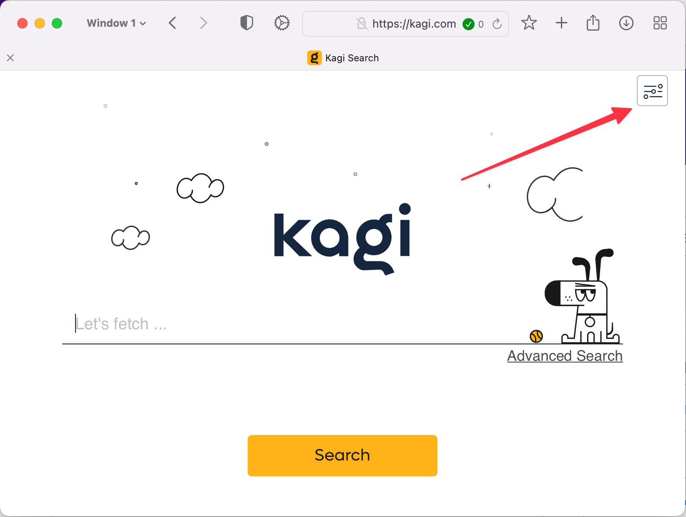
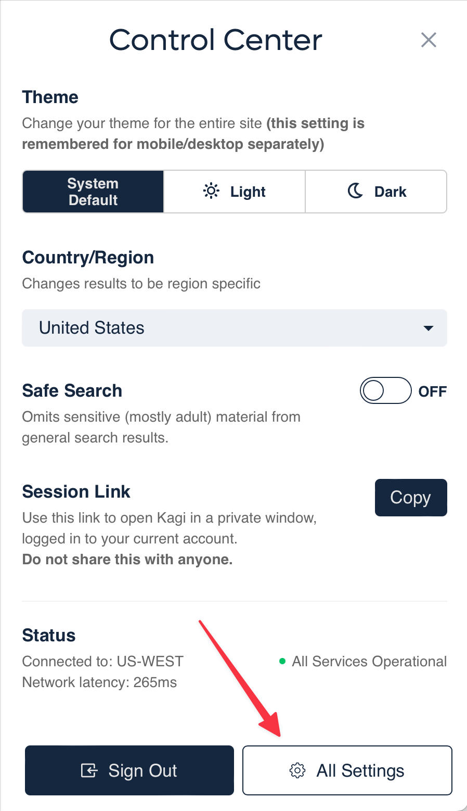
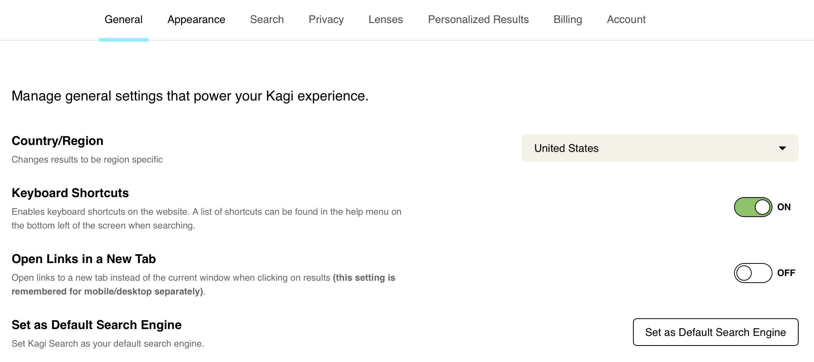
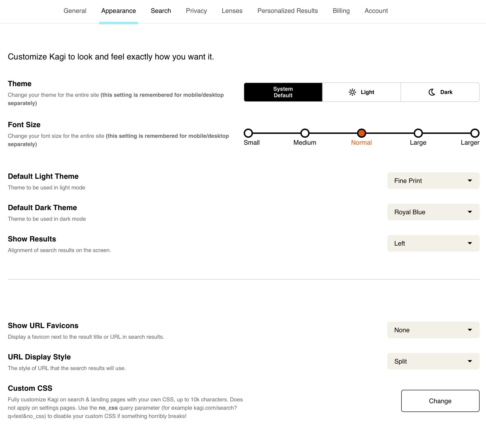
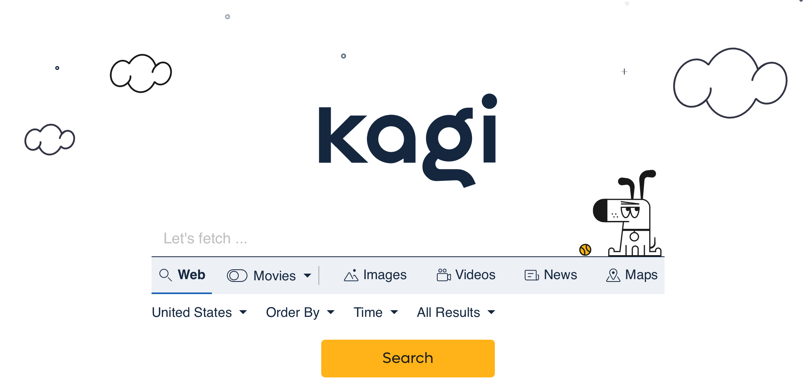
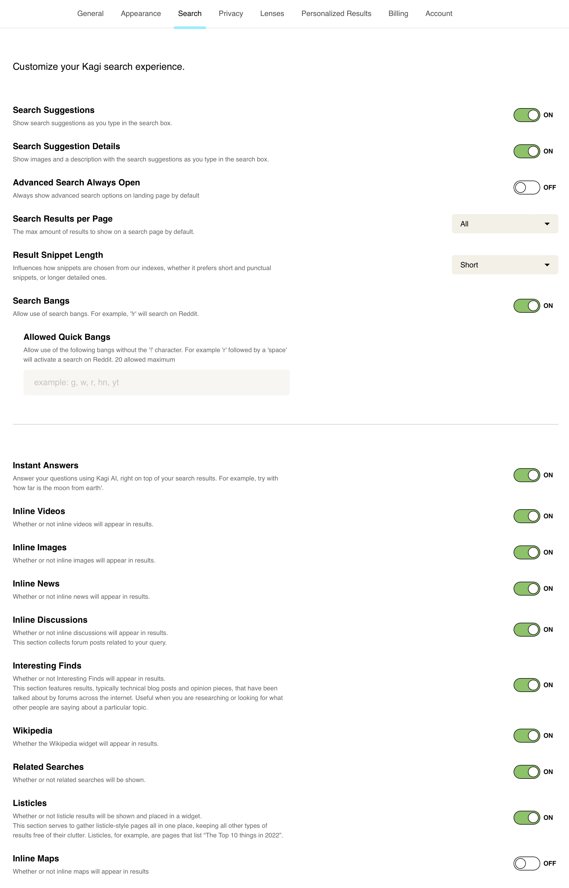
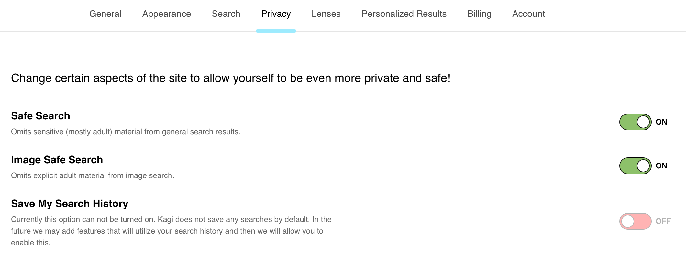
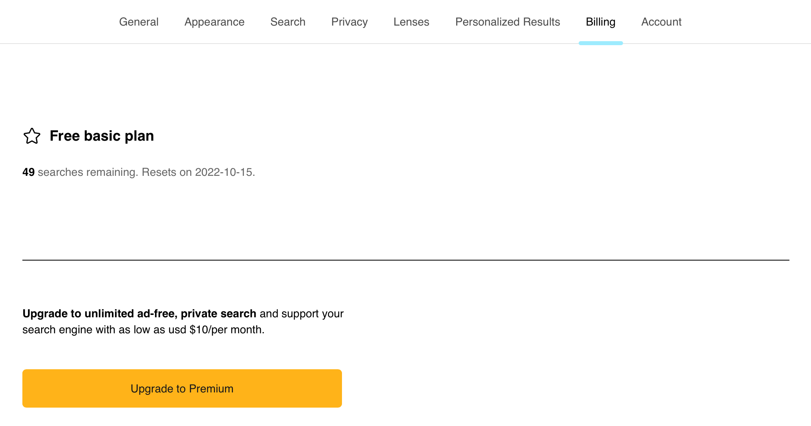
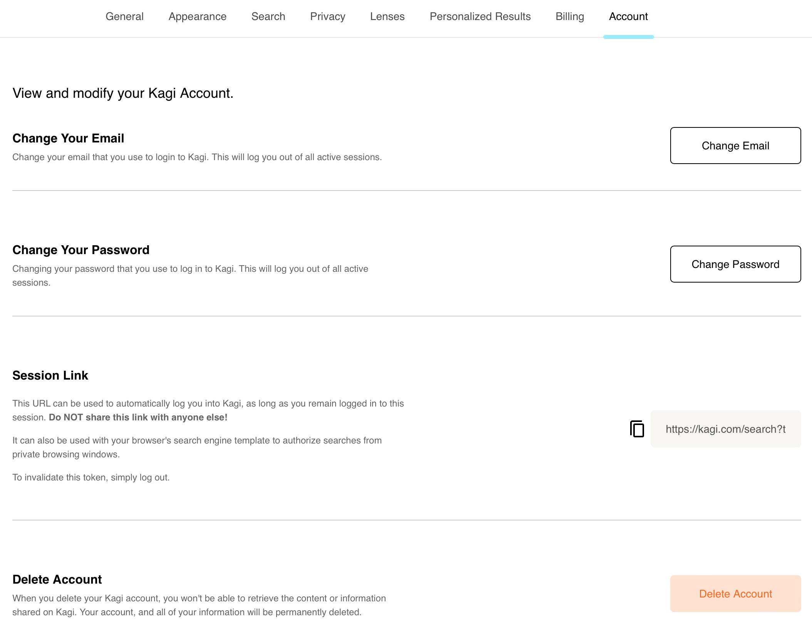

# Settings

## Table of Contents

- [Accessing Settings](#accessing-settings)
- [General](#general)
- [Appearance](#appearance)
- [Search](#search)
- [Privacy](#privacy)
- [Billing](#billing)
- [Account](#account)

## Accessing Settings

You can configure the Settings for Kagi Search from the [Control Center](../getting-started/control-center.md). You access the Control Center using the icon in the upper-right corner of any kagi.com webpage:

 

Use the **[All Settings](https://kagi.com/settings)** button in the lower-right of the Control Center panel to view your Settings.

 

## General

General Settings options:

- **Country/Region** — You can constrain search results to come from a specific country/region or choose to see International results.
- **Keyboard Shortcuts** — You can enable or disable [keyboard shortcuts](search-operators.md#keyboard_shortcuts) in Kagi Search. (If you press **?** on your keyboard (**shift + /**) while in search results, Kagi will open a scrollable window showing the keyboard shortcuts. You can also click or tap **Help** at the bottom of any Kagi webpage to see the shortcuts.)
- **Open Links in a New Tab** — Enable or disable opening links in a new tab instead of the current window when clicking on search results. This setting is stored for mobile and desktop separately.
- **Set as Default Search Engine** — Takes you to information about how to [set Kagi as your default search engine](../getting-started/setting-default.md).

 

## Appearance

Appearance Settings options:

- **Theme** — Change your theme between System Default, Light, or Dark. This setting is stored for mobile and desktop separately.
- **Font Size** — Change your font size between Small, Medium, Normal, Large, or Larger. This setting is stored for mobile and desktop separately.
- **Default Light Theme** — Choose between Calm Blue and Fine Print for the Default Light Theme.
- **Default Dark Theme** — Choose between Royal Blue and Moon Dark for the Default Light Theme.
- **Show Results** — Choose between showing results aligned to the left or center of your screen.
- **Show URL Favicons** — Choose whether to display a favicon next to the result title, the result title, or not at all.
- **Custom CSS** — Access settings to [customize the CSS](custom-css.md) of Kagi search and landing pages.

 

## Search

Search Settings options:

- **Search Suggestions** — Choose whether to see search suggestions as you type in the search box.
- **Search Suggestion Details** — Choose whether to see images and a description with the search suggestions as you type in the search box.
- **Advanced Search Always Open** — Choose whether to show advanced search options on landing pages by default. Here's what that looks like enabled:

 

- **Search Results per Page** — Choose to show All, 10, or 20 results per page.
- **Result Snippet Length** — Influence how snippets are chosen from our indexes, whether to prefer short and punctual snippets, or longer detailed ones.
- **Search Bangs** — Choose whether to allow the use of [search bangs](bangs.md). For example, [!r merge lane etiquette](https://kagi.com/search?q=!r%20merge%20lane%20etiquette) will search Reddit for you.
  - **Allowed Quick Bangs** — Choose whether to use up to 20 bangs without the '!' character. For example, 'r' followed by a 'space' would activate a search on Reddit.
- **Instant Answers** — Choose whether to allow answers to your questions using Kagi AI at the top of your search results. For example, try a search for [how far is the moon from earth](https://kagi.com/search?q=how+far%20is%20the%20moon%20from%20earth).
- **Inline Videos** — Choose whether inline videos will appear in results.
- **Inline Images** — Choose whether inline news will appear in results.
- **Inline Discussions** — Choose whether inline discussions will appear in results.
Discussions are collected from forum posts related to your query.
- **Interesting Finds** — Choose whether Interesting Finds will appear in results.
This section typically features technical blog posts and opinion pieces from forums. It can be useful when researching or looking for what people are saying about a particular topic.
- **Wikipedia** — Choose whether the Wikipedia widget will appear in results.
- **Related Searches** — Choose whether related searches will be shown with results.
- **Listicles** — Choose whether listicle results will be shown. Listicles are short-form writing that uses a list as its thematic structure. For example, a listicle might be called “The Top 10 Things in 2022”. This section gathers listicle-style pages in one place, keeping all other types of results free of their clutter.
- **Inline Maps** — Choose whether inline maps will appear in results.

 

## Privacy

Privacy Settings options:

- **Safe Search** — Choose whether to omit sensitive (mostly adult) material from general search results.
- **Image Safe Search** — Choose whether to omit explicit adult material from image search.
- **Save My Search History** — Currently this option cannot be turned on. Kagi does not save any searches by default. In the future, we may add features that will utilize your search history, and then we will allow you to enable this.

 

## Billing

Billing Settings options:

- We have documentation that covers how to:
  - [Sign up for the Premium Plan](../plans/premium-plan.md#signing_up)
  - [Manage your billing](../plans/premium-plan.md#managing_billing)
  - [Cancel the Premium Plan](../plans/premium-plan.md#cancel_premium)
- **Usage** — This area shows how many searches you've made over time and how that usage relates to any payments you've made.
- **Tip Kagi** — If you find that your Kagi experience surpasses your expectations, or you simply find Kagi a great value, you are welcome to send a tip in an amount of your choosing. Tips are not tax-deductible.

 

## Account

Account Settings options:

- **Change Your Email** — Change the email that you use to log in to Kagi. This will log you out of all active sessions.
- **Change Your Password** — Change the password that you use to log in to Kagi. This will log you out of all active sessions.
- **Session Link** — The Session Link is a URL that automatically logs into your Kagi session. It can be used with [Private Browser Sessions](../privacy/private-browser-sessions.md). Do NOT share your Session Link with anyone else! To invalidate the Session Link, simply Sign Out in the [Control Center](../getting-started/control-center.md).
- **Delete Account** — You can use this option to delete your Kagi account. If you have a Premium plan on your account, the plan will be automatically cancelled when the account is deleted. No refunds or credits are available for cancelled Premium plans.

 
