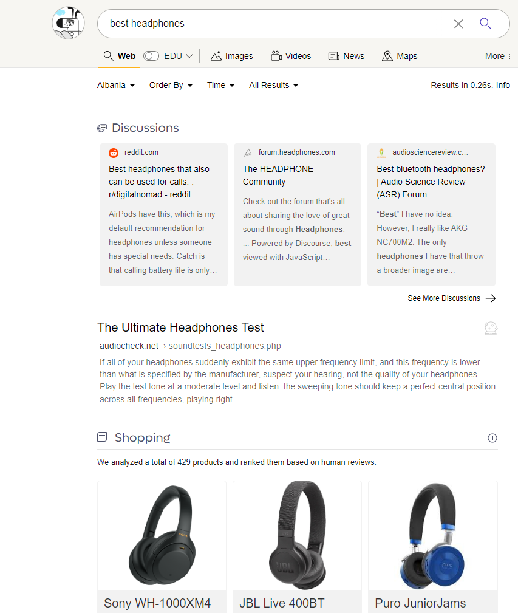
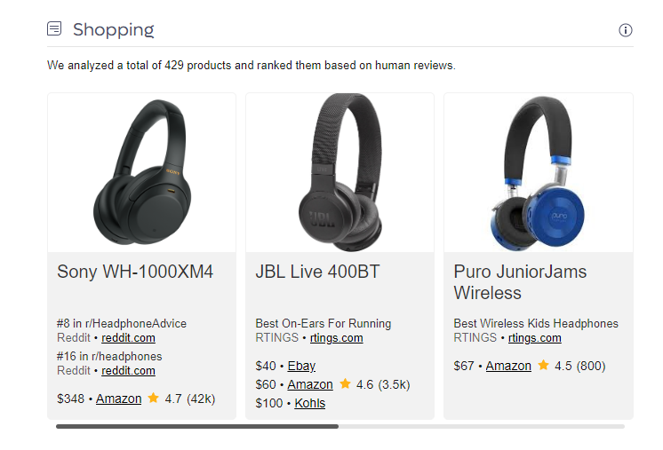

# Shopping

Kagi surfaces shopping results featuring unbiased reviews and no affiliate links to help you identify the best product across categories.

For example, consider searching for "Best Headphones":

Top results include discussions focused on helping you find the best item to purchase - you are not bombarded with affiliate links and ads. Continue to scroll and you will see product comparisons across multiple vendors so you can pick what best suites you.

Keep scrolling and you will see listicles from popular review sites to help you make an informed decision.

Kagi's shopping search will always return a detailed discussion of which product to buy not a competition amongst advertisers promoting where you should buy. Kagi is focused on providing you the best results to make an informed decision not polluted by affiliate links and advertisements.
