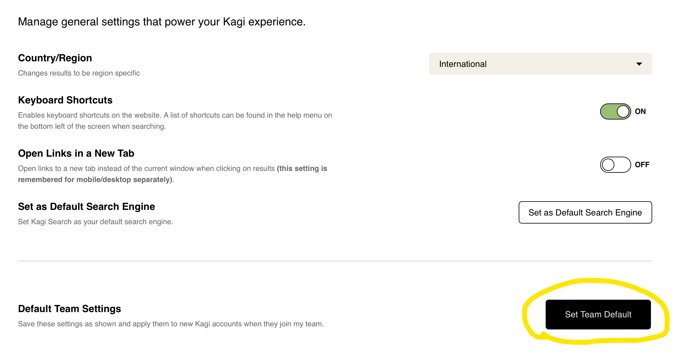
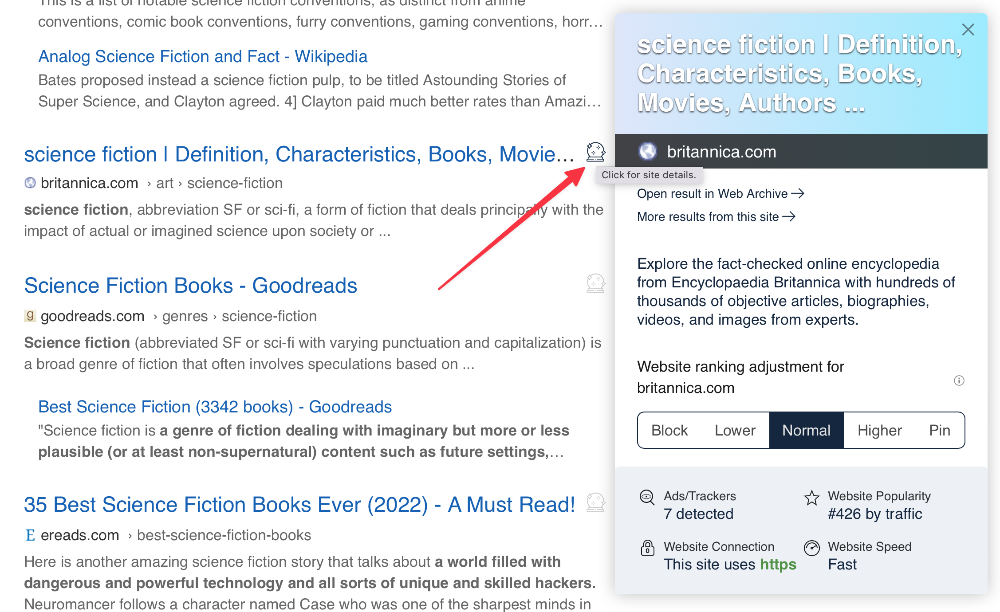
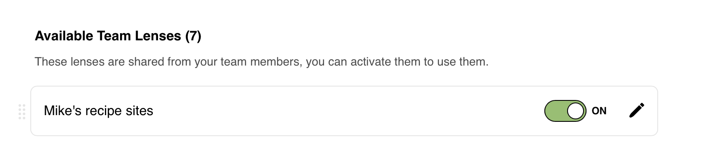
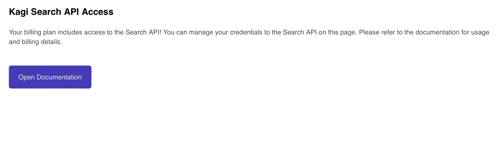
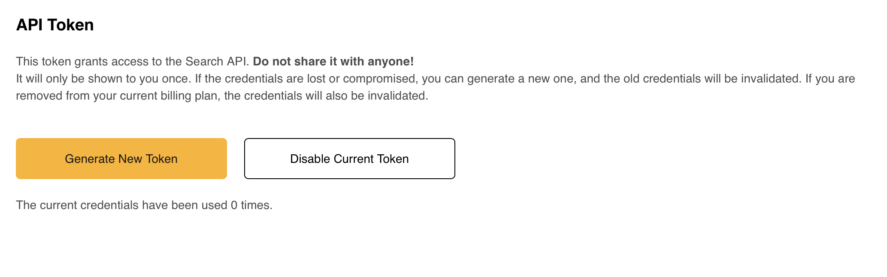
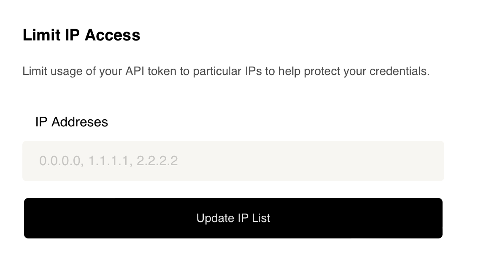

# Team Plan Features

## Team Plan Default Settings
Standardizing on defaults will accelerate the onboarding of new team members and provide a consistent experience for all of your users. Every Kagi setting screen will have a “Set Team Default” button, which allows you to define the default setting for every new team account user.
   

## Shared Domain Ranking Prefernces 
Team Members will share domain ranking preferences facilitating greater collaboration across users. All domains the administrator adds to the [“Raise”](../features/website-info-personalized-results.md) list will be up-ranked in the search results for the entire team. The same goes for the [“Block”](../features/website-info-personalized-results.md), [“Lower”](../features/website-info-personalized-results.md) and [“Pin”](../features/website-info-personalized-results.md) domain lists. You may also elect to leave these blank and defer to individual users for their prioritization.
   

## Shared Lenses
Team Members may choose to share [Lenses](../features/lenses.md) across the team.
   

## Search API
The Team Plan provides access to one of Kagi's most important features - the [Kagi Search API](../search-api/overview.md). This is the same API that Kagi’s front end uses to render the results. The API use is charged the same rate as everyday use ($0.0025/search).

As a first step we recommend reviewing the [Kagi API Documentation](../search-api/overview.md). 
   

Once you are prepared to proceed generate your private API token. 
   

You may also choose to restrict access by limiting communication to selected IPs.
   

