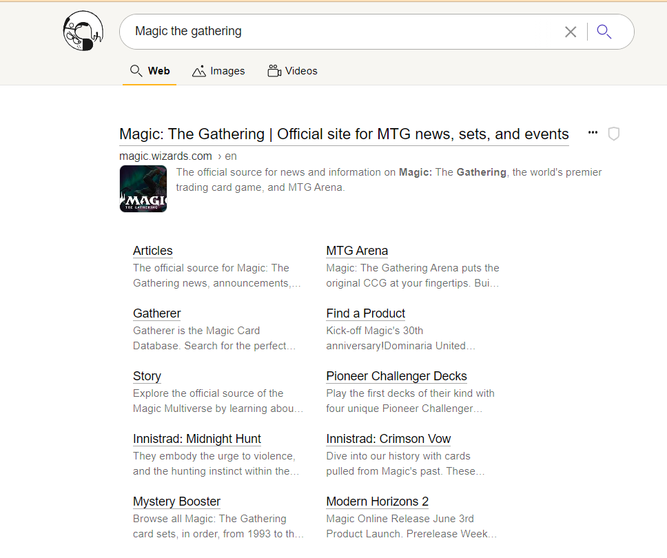

 # Slimmed Down Theme

 User rasti shared a Slimmed Down Theme in the  [Kagi Discord](https://kagi.com/discord) server **\#appearance** channel. This theme removes some of the visual components that are present in Kagi Search, compare


with the following slimmed down page:



 As another example consider


as cmpared with the following slimmed down page:


 To use this theme apply the following custom CSS in your [Appearance settings](https://kagi.com/settings?p=custom_css).

 ```css
 ._0_lenses .k_ui_dropdown {
  display: none;
}
._0_lenses {
  display: none;
}
.serp_nav_end .k_ui_dropdown, .serp_nav_end .k_ui_dropdown_data_list {
  display: none;
}
.sri_more_menu_box .sri_more_menu {
  display: none;
}
.sidebar-filter-nav-form .sidebar-filter-nav {
  display: none;
}
._0_queryInfo {
  display: none;
}
.top-panel {
display: none;
}
._0_item.n_ma{
display: none;
}
.serp-nav{
margin-left: 4px;
}
.search-result, .sri-group {
    margin-left: -17px;
    margin-right: -17px;
    padding: 15px;
    margin-bottom: 0px;
border-bottom: 0px;
}
._0_item.n_ne {
display: none;
}
.m-h {
    padding: 0 10px;
    border-bottom: 0px solid var(--color-primary-dim_2);
}

.m-h .search-form-icons {
    display: none;
}
.theme_moon_dark {
--search-result-title: #a0c5ff;
--result-item-title-border: #141414;
--background-color: #141414;
--site_info_bottom_bg: #141414;
}
.theme_dark {
--search-result-title: #a0c5ff;
--result-item-title-border: #141414;
--background-color: #141414;
--site_info_bottom_bg: #141414;
}
.theme_calm_blue {
--background-color: #f2f2f6
}
.sri-url .sri_url_path_box {
}
.sri-url .path {
    display: none;
}
.domain-favicon {
  display: none;
}
.m-h .m-h-i {
    height: 65px;
}
.crisp-edges {
    image-rendering: optimizespeed;
    image-rendering: crisp_edges;
}
.sri-desc {
    font-size: .88rem;
    line-height: 1.4;
}

.rewrite_icon {
    margin-left: 0px;
}
.m-image-domain {
    display: none;
}
.m-image-res {
    display: none;
}
.btn.--secondary-s, .ranked-item-tab-links a.--secondary-s {
    display: none;
}
.m-image-preview-buttons a i {
    display: none;
} 
.m-image-preview-data-box span:first-child {
    display: none;
}
._0_img-results .item img.fade {
    opacity: 0;
    transition: none;
}
.quick-search-btn {
    transition: transform .4s ease-in-out;
}
.d-info-box-title-header {
    height: 164px;
}
.videoResultItem .videoResultRight .videoResultDesc {
    display: none;
}
.instant-answer .ia-body .ia-title>div {
    display: none;
}
.inline-content+.search-result, .inline-content+.sri-group {
    border-top: 0px solid #a0c5ff
}
.instant-answer {
    padding-bottom: 13px;
    padding-top: 13px;
    border-top: 1px solid #a0c5ff;
    border-bottom: 1px solid #a0c5ff;
}
```
