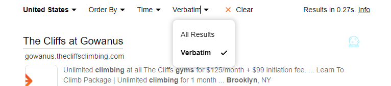
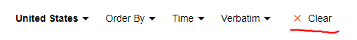

# Verbatim Search

Kagi will return "All Results" to a search based on the default settings as seen below.

You may further filter results by choosing to perform a "Verbatim Search" by expanding the "All Results" drop down.

Once this option is set it will stay enabled until you "Clear" the filter.

