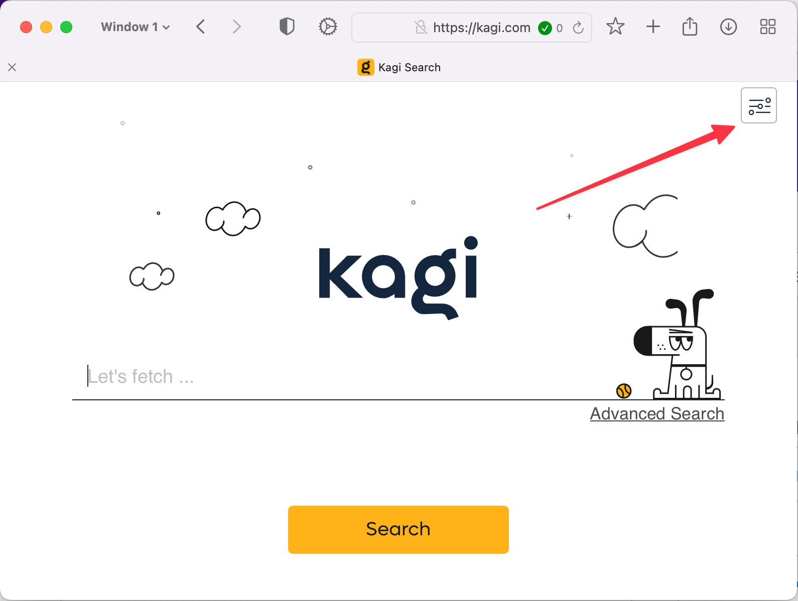
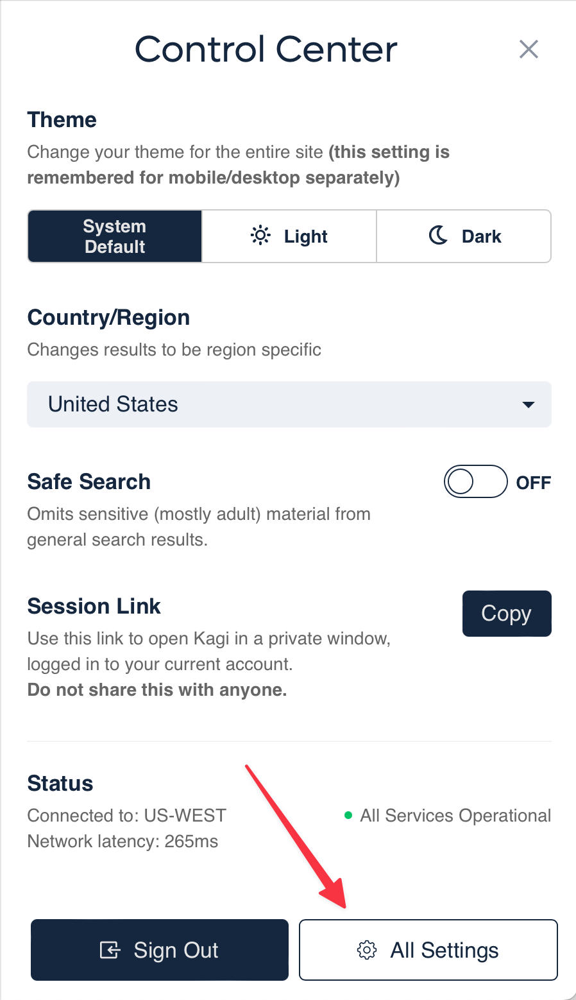

# The Control Center

You can configure Kagi's search and account settings using the Control Center. You access the Control Center using the icon in the upper-right corner of any kagi.com webpage:

 

Clicking or tapping on the icon will make the Control Center panel slide out from the right side of the page. Here you can configure settings such as:

* Theme
* Country/Region
* Safe Search

You can also:

* Copy your Session Link
* See the Status of your Kagi Search service
* Sign Out of your Kagi Search account
* Use the **[All Settings](https://kagi.com/settings)** button in the lower-right of the panel to configure many more search and account settings. You can also read [documentation](../features/settings.md) about Kagi's settings.

 
