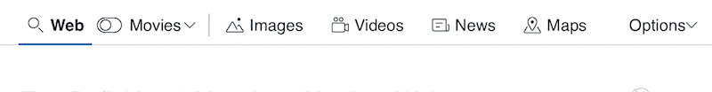
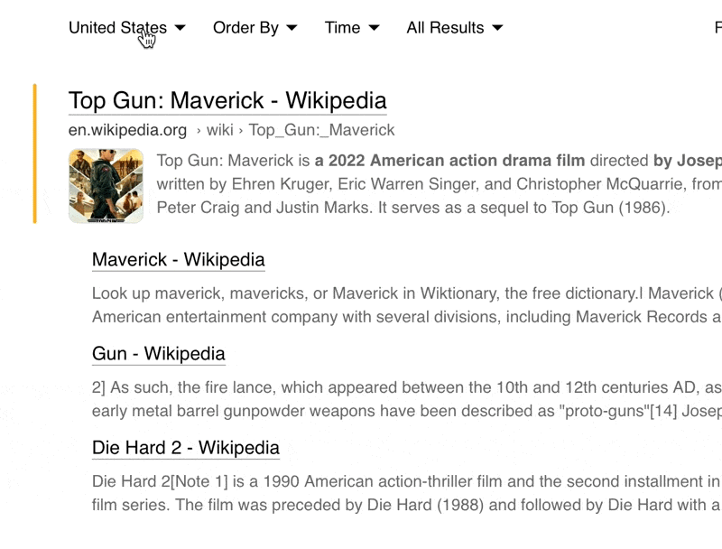
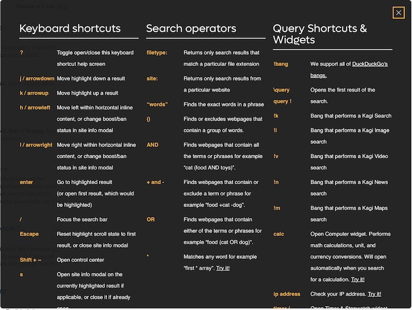

# Quick Start

## Table of Contents

- [Signing Up](#signing_up)
- [Basic Searches](#basic_searches)
- [Filter Search Results](#filter_results)
- [Using Search Operators](#search_operators)
- [Bang Searches](#bang_searches)
- [Lens Searches](#lens_searches)
- [Personalized Results](#personalized_results)

## Signing Up

Before you can use Kagi, you need to visit [https://kagi.com](https://kagi.com) and sign up for a [**Free Basic** or **Premium**](../plans/plan-types.md) plan.

## Basic Searches

To do a basic search, simply visit [https://kagi.com](https://kagi.com) and search for something.

 

Or, if you've [set Kagi as your default search engine](setting-default.md), you can do a search from your browser's address bar.

## Filter Search Results

You can [filter](../features/filtering-results.md) your search results to focus on the results you most care about.

 

 

## Using Search Operators

If you press **?** on your keyboard (**shift + /**) while in search results, Kagi will open a scrollable window showing keyboard shortcuts, search operators, query shortcuts, and widgets. You can also click or tap **Help** at the bottom of any Kagi webpage to see the same information.

 

For example, searching for [outfit movie !](https://kagi.com/search?q=outfit%20movie%20!) will take you straight to the first result for that query.

 

You can read [documentation](../features/search-operators.md) that covers the search operators in detail.

## Bang Searches

Kagi supports all DuckDuckGo-style [bangs](../features/bangs.md). Bangs are shortcuts starting with exclamation points (!) that quickly take you to search results on other sites.

For example, searching Kagi for **!w Monty Python** will search Wikipedia directly for "Monty Python" and take you to that Wikipedia search result.

 

## Lens Searches

Kagi [Lenses](../features/lenses.md) allow you to customize your searches by specifying which websites (and other parameters) you see in your results. We provide a few Lenses to get you started, such as one to search only online discussions and forums. You can also create your own!

Here's an example using the built-in EDU lens:

 

## Personalized Results

You can tweak how the website for a result is treated in future Kagi searches using [Personalized Results](../features/website-info-personalized-results.md#personalized_results).

 

You can see your Personalized Results for all websites in [Settings](https://kagi.com/settings?p=user_ranked).

