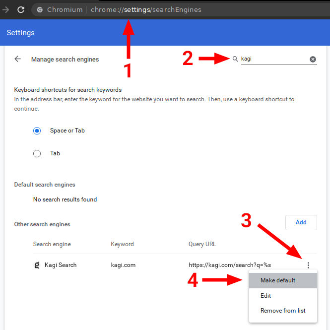
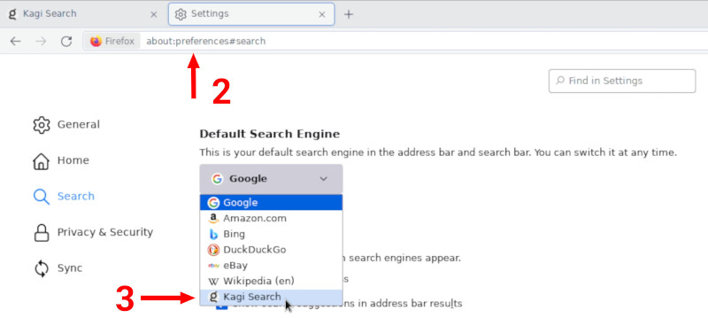

# Setting Kagi as Your Default Search Engine

## Table of Contents
- [Option 1: Using the Kagi Browser Extension](#browser_extension)
  - [Access to Safari Browsing History](#safari_extension)
  - [Note for Brave Browser Users](#brave_extension)
- [Option 2: Manual Configuration](#manual_configuration)
  - [Chromium-Based Browsers (Chrome, Edge, Brave, Opera, Vivaldi...)](#chromium_browsers)
    - [Desktop](#chromium_desktop)
    - [Mobile](#chromium_mobile)
  - [Firefox-Based Browsers](#firefox_browsers)
    - [Desktop](#firefox_desktop)
    - [Android Mobile](#firefox_android_mobile)
  - [Safari](#safari)
    - [Desktop](#safari_desktop)
    - [iOS & iPadOS](#safari_ios_ipados)
  - [Custom Use](#custom_use)
  - [Private Session](#private_session)

## Option 1: Using the Kagi Browser Extension

Kagi is available as an extension for all major browsers. The extension sets Kagi as the default search engine and allows you to search with Kagi even in a private window.

Extension download links:

- [Chromium-based browsers](https://chrome.google.com/webstore/detail/cdglnehniifkbagbbombnjghhcihifij0) (Chrome, Edge, Brave, Opera, Vivaldi...)
- [Firefox-based browsers](https://addons.mozilla.org/en-US/firefox/addon/kagi-search-for-firefox/)
  - If you use Firefox on Android, check out [this guide](https://blog.mozilla.org/addons/2020/09/29/expanded-extension-support-in-firefox-for-android-nightly/). Android doesn't set Kagi as the default search engine, but it allows search in private mode to work normally.
- [Safari for macOS](https://apps.apple.com/app/kagi-search-for-safari/id1622835804)
- [Safari for iOS and iPadOS](https://apps.apple.com/app/kagi-search-for-safari/id1607766153)
- The [xSearch](https://apps.apple.com/us/app/xsearch-for-safari/id1579902068) and [HyperWeb](https://apps.apple.com/us/app/hyperweb/id1581824571) extensions for Safari also support Kagi

If you are a macOS, iOS, or iPadOS user, you can complement your Kagi experience with the free [Orion](https://browser.kagi.com) web browser, produced by the same team that built Kagi Search.

### Note for Safari Users: Browsing History

When you install the Kagi Search browser extension in Safari, you will see the extension requires access to your browsing history. This access is needed so the extension can intercept queries sent to other search engines and instead send them to Kagi Search.

No data from your browsing history is sent to Kagi Search beyond the search queries you make while running the extension. All queries made to Kagi Search are anonymized, never being tied to your specific Kagi Search account.

### Note for Brave Users: Settings Update

In addition to installing the Kagi Browser Extension, Brave users must also make a settings change in the Brave web browser:

1. Go to **Settings** > **Search engine** ([link](brave://settings/?search=index+other+search)).
2. Turn on the "Index other search engines" option.

## Option 2: Manual Configuration

You can configure your web browser manually to use Kagi as its default search engine.

### Chromium-Based Browsers (Chrome, Edge, Brave, Opera, Vivaldi...)

#### Desktop

1. Open this URL in your search bar: [chrome://settings/searchEngines](chrome://settings/searchEngines).
2. Click **Add** and fill in these details: 
  - **Search engine:** Kagi Search
  - **Keyword:** kagi
  - **Query URL:** https://kagi.com/search?q=%s
3. Click the three dots.
4. Click **Make default**.

 

#### Mobile
1. Open [https://kagi.com](https://kagi.com), log in, and submit a search.
2. Open your browser’s settings. Choose **Search engine**.
3. Select **Kagi Search** from the Recently Visited section.

### Firefox-Based Browsers

#### Desktop

1. Open [https://kagi.com](https://kagi.com), then right-click the browser address/search bar and select **Add Kagi Search**.
2. Open this URL in your search bar: [about:preferences#search](about:preferences#search)
3. Scroll to **Default Search Engine** and select **Kagi** from the dropdown.

To set up a private session link in Firefox, use [this extension](https://addons.mozilla.org/en-US/firefox/addon/add-custom-search-engine/) with:
[https://kagi.com/search?token=TOKEN&q=%s](https://kagi.com/search?token=TOKEN&q=%s)

#### Android Mobile

1. Tap the three-dot menu button.

2. Tap **Settings**.
3. In the **General** section, tap **Search**.
4. Tap **Add search engine**.
5. A list of additional predefined search engines will be displayed.
6. Tap the **Other** radio button to add a search engine and do the following:
  - in the **Name** field, enter **Kagi**.
  - In the **Search string to use** field, enter **https://kagi.com/search?q=%s**
  - Tap the confirmation button in the top right corner of the screen.

### Safari

#### Desktop

1. Install the [Kagi Search for Safari extension](https://github.com/marcocebrian/kagisearchsafari) made by one of our community members.
2. Activate the extension in **Safari -> Preferences -> Extensions**.
3. Enjoy Kagi search from your Safari address bar!

If you are a macOS, iOS, or iPadOS user, we strongly recommend using Kagi with the free [Orion](https://browser.kagi.com/) web browser, produced by the same team that built Kagi.

#### iOS & iPadOS

Use the [Orion iOS/iPadOS web browser](https://testflight.apple.com/join/DeC8ZDnu) (still in beta), which has native support for Kagi Search.

If you prefer to use Safari, you can use the [Kagi Search for Safari extension](https://github.com/marcocebrian/kagisearchsafari) made by one of our community members.

### Custom Use

For a search URL use:
[https://kagi.com/search?q={searchTerms}](https://kagi.com/search?q={searchTerms})

and for autosuggestions use:
[https://kagi.com/api/autosuggest?q={searchTerms}](https://kagi.com/api/autosuggest?q={searchTerms})

### Private Session Link

To use Kagi Search inside a private browser session, you can use the Session Link found in your [Account Settings](https://kagi.com/settings?p=user_details).
