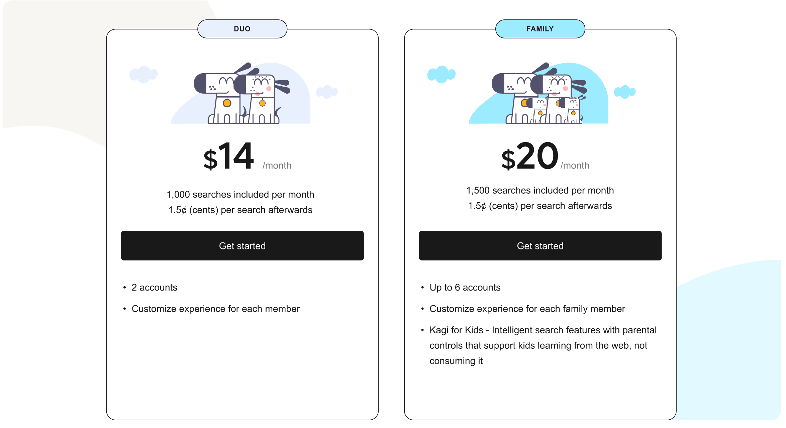

# Family Plan

Since the inception, Kagi has been driven by the idea of humanizing the web, especially for families and kids. Our commitment to this cause was the inspiration behind the creation of Kagi. Many of our staff are parents are are working together to build a better search and web future for our children. We strive to provide a search engine that prioritizes the well-being of your loved ones, particularly the most vulnerable ones like children, by offering an ad-free and safe browsing experience. We offer two different group plans based on your specific needs. 

* The **Duo** plan offers 1,000 searchs at USD $14 per month making it ideal for couples.
* The **Family Plan** offers 1,500 searches at USD $20 per month and features kid focused features and protections making it ideal for entire families to enjoy Kagi. This is a shared pool of searches across all members. 

## Kid Friendly Features

**More Information Coming EOM March 2023**