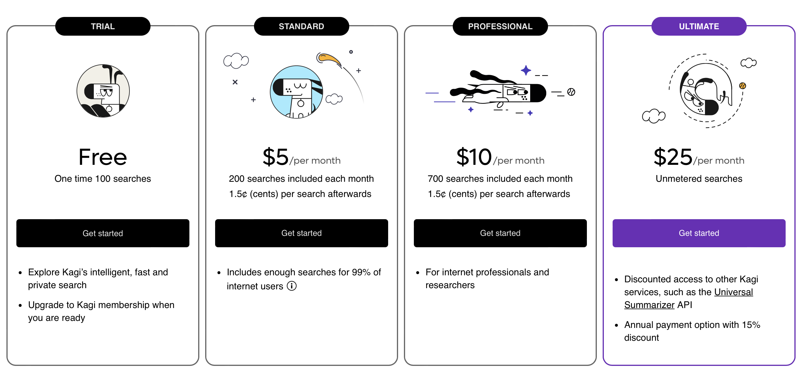
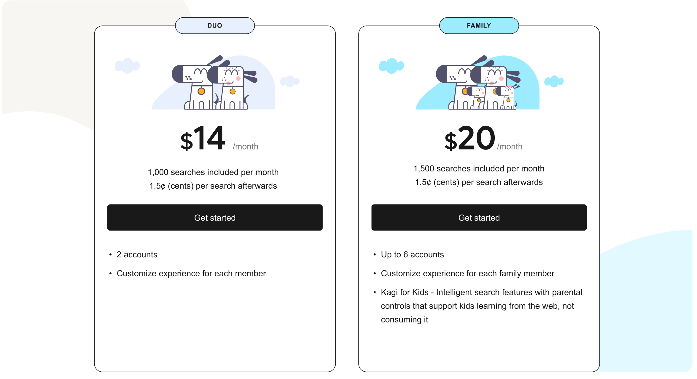
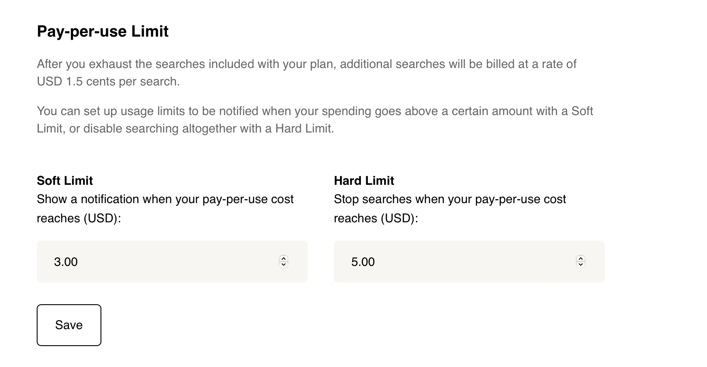

# Plan Types

Kagi offers several subscriptions models:

* The **Free** plan is limited to 100 total searches. 
* The **Standard** plan offers 200 searches for USD $5 per month. This plan is suited for users who are new to paid search engines and are looking to own their search experience. 
* The **Professional** plan offers 700 searches USD $10 per month. This plan is suited for internet professionals and developers who are prolific and advanced search usesrs. 
* The **Ultimate** plan offers unlimited searches for USD $25 per month and offers the most flexiblity and power to the user. 

In addition to the individual plans we also offer bundled plans:

* The **Duo** plan offers 1,000 searchs at USD $14 per month making it ideal for couples.
* The **Family Plan** offers 1,500 searches at USD $20 per month and features kid focused features and protections making it ideal for entire families to enjoy Kagi. 

## Pay Per Use Enhancement 
The **Standard** and **Professional** plans both feature a **Pay Per Use** option where searches after the included searches are priced at 1.5 cents per search. Users will have a feature to control pay-per-use costs via customizable soft and hard limits. Reaching the soft limit triggers a notification; the hard limit prevents further searches.

## Legacy Subscribers and Early Adopters 
For any existing subscribers and early adopters who are interested in how legacy accounts will be used and maintained please refer to the blog post [Updated to Kagi Search pricing](https://blog.kagi.com/update-kagi-search-pricing).

## Understand Your Consumption
Kagi has a feature to check your [current search usage](https://kagi.com/settings?p=consumption) to get a better sense of which plan is right for you.

## Why Tiered Pricing
This tiered pricing system is easy to understand and ensures Kagi’s financial sustainability for the future so that we can continue to provide you with the tools to own your search expeirence as we puruse our mission to humanize the web. 