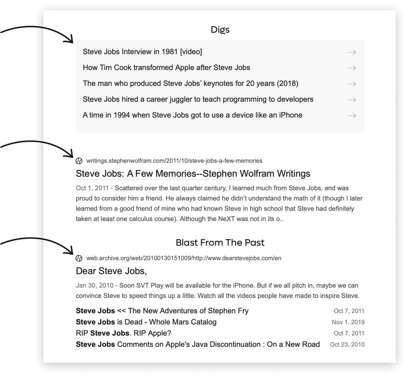

# Search Quality

## Relevant and Authentic Search Results

Kagi can surface unique, high-quality, non-commercial content while avoiding results bloated by ads and tracking. Kagi's non-commercial index (Teclis) and non-commercial news index (TinyGem) as well as instant answers (IA) offer high-quality, relevant, and authentic results for the user. Clicking **Info** in search results will show a percentage of these unique Kagi results in search results.

Take a look at Kagi’s responses to a “steve jobs” query:

 

These results are authentic to Kagi. To provide them, we even crawl the [Wayback Machine](https://archive.org/) to dig up great content that no longer exists in its original state online. In every search, Kagi will always display unique results when possible as well as some of the typical fare.

# How We Rank Results

Our algorithm primarily focuses on relevancy and user intent. When it makes sense, we try to prioritize non-commercial sources. A highly relevant answer to your query from a monetized site will fall lower in your results than the same answer from an educational site. Of course, if a site has a naturally high rank, Kagi factors that in as well. And if you personalize your searches, domains you [lower](../features/website-info-personalized-results.md#personalized_results) will lose ground to domains you [prefer](../features/website-info-personalized-results.md#personalized_results).

# Number of Results

We believe the name of the game in search is quality, not quantity. A search engine's job is to provide the best answer fast and within the reach of one or two pages of results. If the user needs to go to page 17 to find what they were looking for, we have failed.

Also note that one page of Kagi results will show 20-30 organic results compared to just 10 results typically shown on other search engines. So two pages of Kagi results are actually an equivalent of about six pages of results in other search engines!

Other search engines may also show an inflated number of results available. The reality is they don't really have that many results. You can check yourself by clicking through pages of their results, which at one point abruptly stop. Between deceiving users with a provisional high results number and showing the best results, we chose the latter.

We feel our approach is in line with our values. In the unlikely event of not finding what you are looking for, you can always modify the query slightly to get new results.

# Avoiding Censorship and Bias

We do our best to avoid censorship and bias. Some results from traditional sources will reflect biases, but they’ll be balanced by results from other sources. Also, we have built product features to help with bias reduction. For example, our "News 360" [Lens](../features/lenses.md) includes articles from respectable media outlets across the globe.

One of the signals that does influence our ranking is the presence of ads or trackers. We penalize bloated sites regardless of their agendas.
