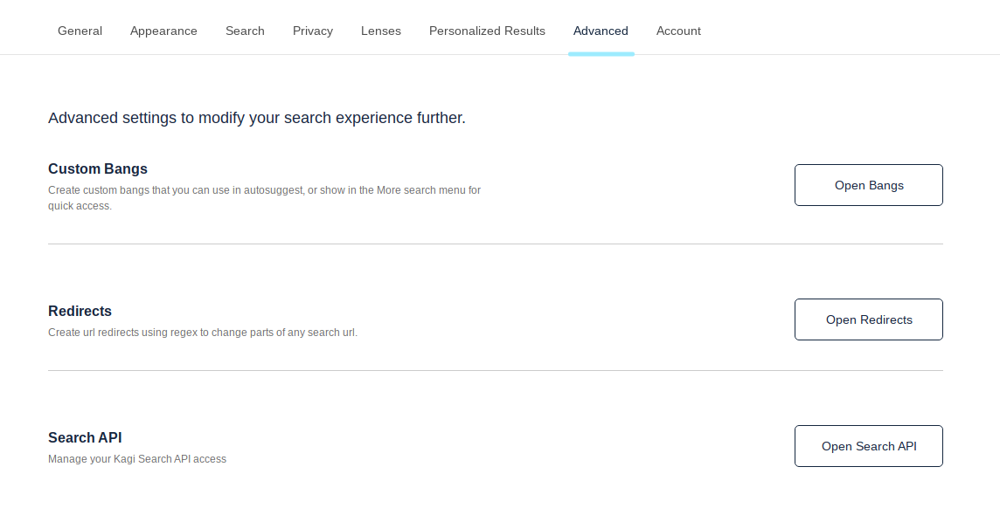

# Advanced

This settings page gives you access to more powerful features of Kagi.

## Custom Bangs

Create and manage custom [Bangs](../features/bangs.md) to easily search other websites from Kagi.

[Read more about Custom Bangs](../features/bangs.md#custom-bangs)

## Redirects

Redirects are a powerful feature that allow you to make modifications to search result URLs with textual find & replace.

[Read more about Redirects](../features/redirects.md)

## Search API

Control panel for the [Search API](), for developers looking to build something with Kagi Search results.

[Read more about the Search API](../search-api/overview.md)
