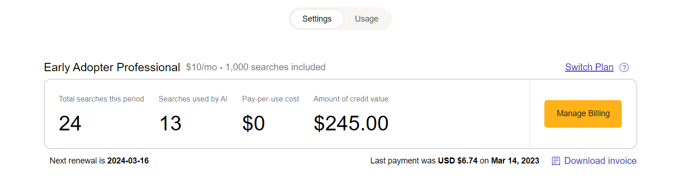

# Billing

> **Important Notice:** Our pricing is changing on March 15th.
>
> [Please see our blog post for details!](https://blog.kagi.com/update-kagi-search-pricing)

These settings control your billing options and status with Kagi.

We have documentation that covers how to:
  - [Sign up for the Premium Plan](../plans/premium-plan.md#signing_up)
  - [Manage your billing](../plans/premium-plan.md#managing_billing)
  - [Cancel the Premium Plan](../plans/premium-plan.md#cancel_premium)

If you are an active subscriber, you will have some additional options:

- **Usage** — This area shows how many searches you've made over time and how that usage relates to any payments you've made.
- **Tip Kagi** — If you find that your Kagi experience surpasses your expectations, or you simply find Kagi a great value, you are welcome to send a tip in an amount of your choosing. Tips are not tax-deductible.

## Need to Retry Billing
If your billing gets declined you will need to retry the billing attempt for the invoice by selecting the Manage Billing option.

If you are on a personal plan the option will look like this:

If you are on a team plan the option will look like this:

