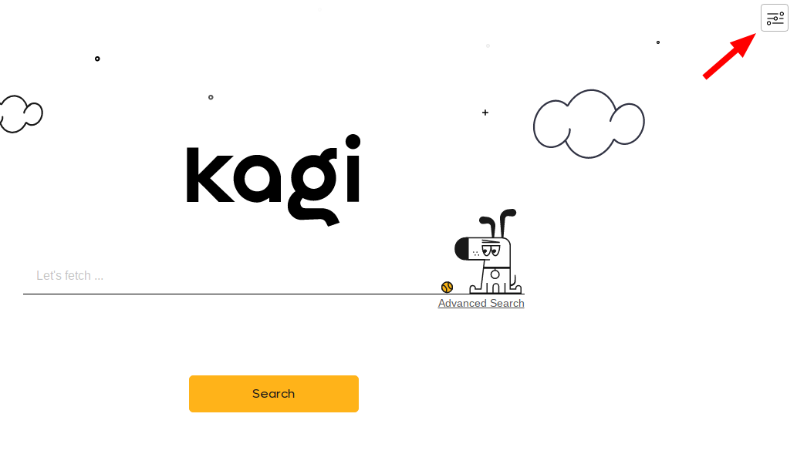
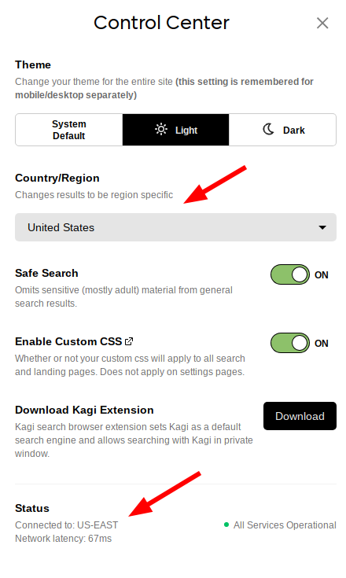

# Reporting a Bug

To report a bug, head out to [KagiFeedback.org](https://kagifeedback.org).

When reporting a bug, it is important to give us as much information as
possible to help narrow down what the issue may be. Search engines are
very complex pieces of software—every detail matters!

Whenever you open a bug report, you will be given a template that you can
fill out that will help you write your report. Here is a breakdown of what is
included, and how it helps us!

## Describe Your Issue

1. **Your query**. The best way is to give us a direct link to the search or page you are having issues with, so we can simply click it and check it out. Thank you!

2. **Steps to reproduce**. Sometimes a problem is more than just "search for cute dogs"—please include a clear list of instructions to reproduce the issue, even if you think it may be obvious.

3. **A screenshot or video of the issue**. Very often, this is the **best** way to help us understand your issue. A picture really is worth a thousand words when it comes to bug reports!

## Give Us Some Context

1. **Your browser and device (desktop or mobile)**. If you are on a special build, such as "Firefox Nightly", that is helpful to know as well! Testing multiple browsers is also a great help.

2. **Your search region**. Sometimes, your search region can be a factor in the quality of results and the behavior of Kagi. Without this, it may be much harder to reproduce certain issues.

3. **Your Kagi node**. Kagi is made up of many servers around the globe to give you the best latency and reliability possible. This will help us identify if issues are isolated to specific servers, or are a wider issue.

## Things to Try

Sometimes there are a few things you can do to help us narrow down certain issues. Depending on the problem, you can try:

- Turn off custom CSS
- Disabling all browser extensions
- Refreshing the page
- Logging out & logging back in
- Waiting for some time, then trying again

## Common Questions

### How do I find my search region and "Kagi node"?

1. Open the Control Center in the upper-right corner of any page

2. Find the dropdown that says "Country/Region". Here, "United States" is the current region.

3. At the bottom, you will see "Connected to: US-EAST". Here, "US-EAST" is the current Kagi node.

### I have an issue with my subscription or billing!

Please email us at [support@kagi.com](mailto:support@kagi.com). When emailing, please include the email address associated with your Kagi account so that we can help you more quickly.

### I found a potential security problem!

Please email [our security contact](mailto:vlad@kagi.com).

### I have an issue with the Orion browser

Please report the issue on the [Orion Feedback Forum](https://orionfeedback.org).

### My report includes NSFW media

Please don't post explicit images, videos, or text directly on the site.

If you can, please censor the images. Otherwise, you can leave them out. If we need them, we will ask you to provide them another way.

### I just have a question or want to chat with other Kagi users!

If you are just looking to chat or need some help, you are welcome to join our [Discord server](https://kagi.com/discord).
