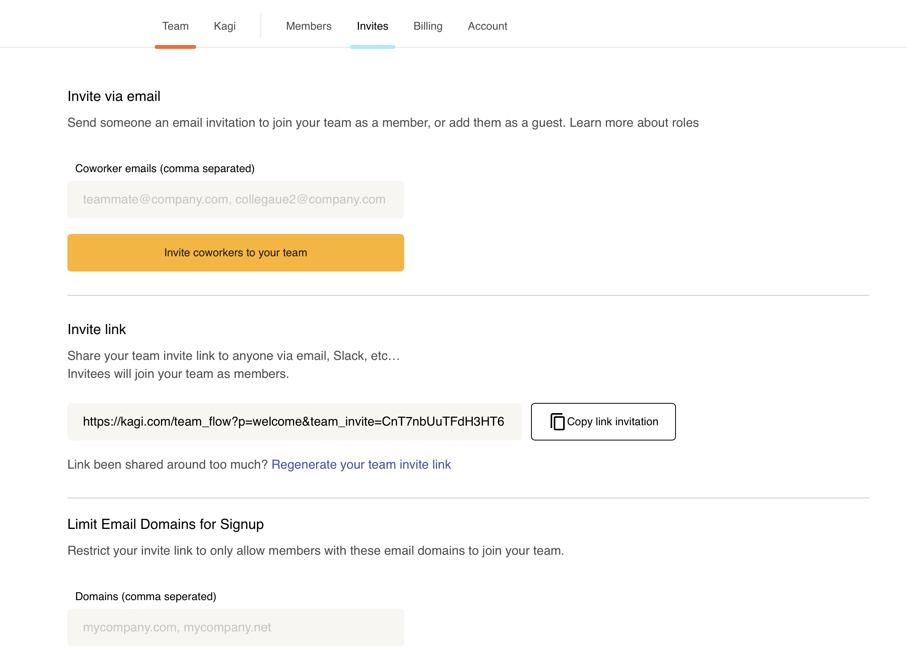
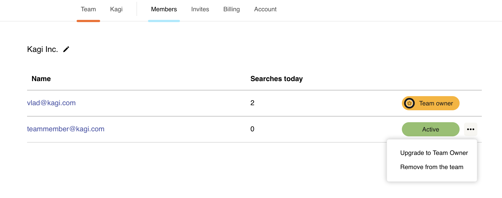
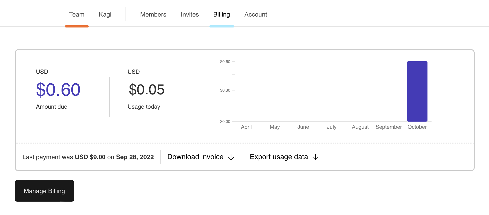

# Team Plan

## Signing Up for the Team Plan

You can [Sign Up](https://kagi.com/signup) for a new Kagi account and add the [Team Plan](plan-types.md) during the sign-up process.

If you already have a Kagi account, you can add the Team Plan in your [Billing settings](https://kagi.com/settings?p=billing).

You will need to specify a company when signing up for a Team Plan. 

You can also check out all [Team Plan Features](../features/team-plan-features.md).

## Adding Team Members
Since the Kagi Team Plan is pay-per-use ($0.025 per search), you can add as many team members as possible and only pay for those that are actively searching. 

From the [Invites tab](https://kagi.com/settings?p=invites) there are two ways to add new team members. 
1. Send the new members an email through Kagi.
2. Generate an invite link and share with the new members. 

You can also limit the domains used to sign-up to your team to your company’s domain or reset the invite link if necessary.

## Removing Team Members
From the [Members tab](https://kagi.com/settings?p=members) you can remove team members by selecting the ellipses (...) next to the user and selecting "Remove from the team". 

## Upgrade Team Members
From the [Members tab](https://kagi.com/settings?p=members) you can upgrade team members by selecting the ellipses (...) next to the user and selecting "Upgrade to Team Member". 

## Managing Usage
From the [Billing tab](https://kagi.com/settings?p=billing) you can see your team's usage, the usage history and the amount due. You may also download the invoice or export daily usage data (count of searches).

## Managing Billing
To manage your Kagi [Premium plan](plan-types.md) billing, go to your [Billing settings](https://kagi.com/settings?p=billing).

Once in Billing settings, click the **Manage Billing** button. This button will take you to a webpage for Stripe, our payment processor.

From that Stripe page, you can:

- Change your payment method
- Change your billing information
- See your invoices
- Switch between monthly and annual billing (use the **Update plan** button)

## Canceling the Team Plan

If you want to cancel your Team Plan, you can do so in your Kagi account's [Billing settings](https://kagi.com/settings?p=billing):

1. Once in Billing settings, click/tap the **Manage Billing** button. This will take you to a webpage for Stripe, our payment processor. 
2. Click/tap the **Cancel plan** button.
3. On the next webpage, click/tap another **Cancel plan** button to confirm the cancellation.

No refunds or credits are available for canceled Team plans.
