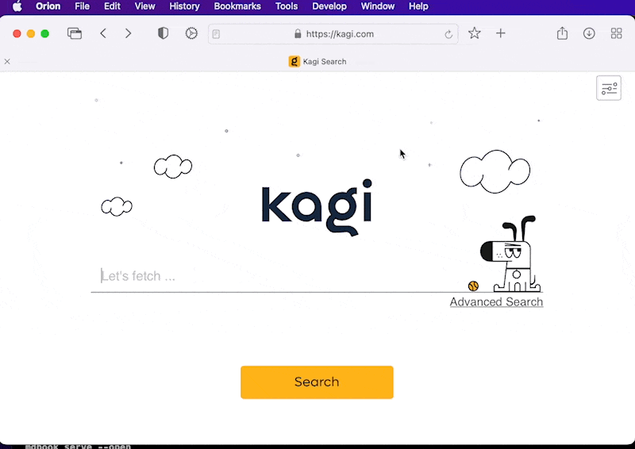

# Viewing Web Archives

If a webpage won't load in Orion for macOS or you want to see an earlier version of it, you can see if the page is stored in the [Wayback Machine Internet Archive](https://web.archive.org).

While viewing the page in Orion for macOS (or trying to view it), click the **Tools** menu and choose **Open Page in Internet Archive**.

Here's an example of kagi.com's previous life when our domain was used by a payment processor:

 

