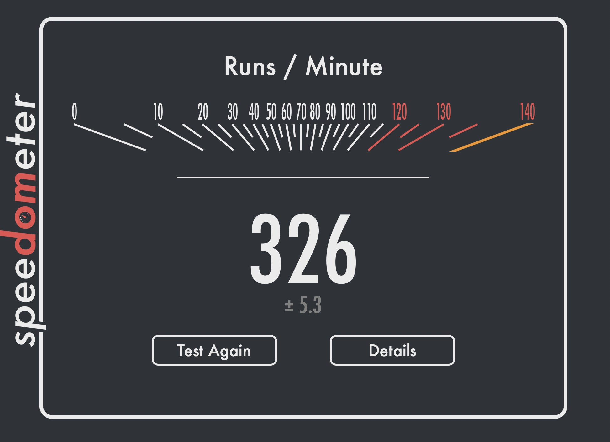

# Orion Speed

Orion is [as fast or faster than Safari](https://twitter.com/vladquant/status/1373379807778512896), because while both use the WebKit engine, we streamlined our browser for smoother use. Orion is much faster than non-WebKit browsers like Firefox or Chrome and its derivatives (Edge, Brave, Opera, etc.).
  
 

Orion scores 326 on Speedometer 2.0 (using M1 MacBook Pro, with Orion's Compatibility mode ON) which is the fastest performance of any browser in existence (that we know of).   
  
On top of this, the native ad blocker makes Orion simply unrivaled in browsing speed. And, thanks to thoughtful optimizations, Orion feels faster and more responsive than Safari on slow and old Macs.