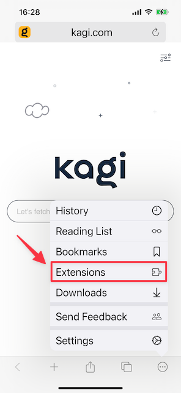
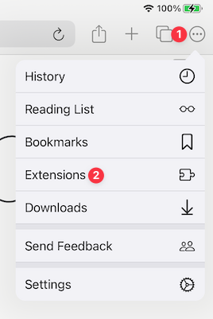
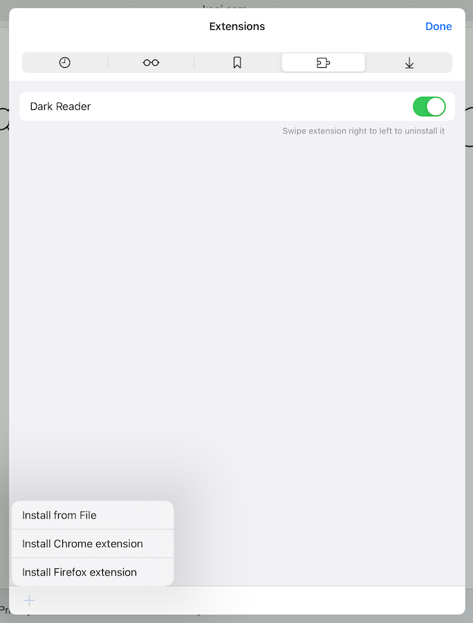

#  iOS & iPadOS Extensions

## Table of Contents

- [Overview](#overview)
- [iOS Extensions Management](#ios_management)
- [iPadOS Extensions Management](#ipados_management)
- [Safari Extensions Not Supported](#safari)

## Overview

 

Orion is the first web browser to offer preliminary support for some Chrome and Firefox browser extensions on iOS and iPadOS.

We've ported [hundreds of web extension APIs](macos-extensions.md#chrome_and_firefox) to run on top of the WebKit browser engine, which also runs on iOS and iPadOS.

We’re limited in the scope of APIs we can support. But, those that we do support will work out of the box, same as on desktop. And, you can one-click install them from the [Chrome](https://chrome.google.com/webstore/category/extensions) or [Firefox](https://addons.mozilla.org/en-US/firefox/extensions/) extension websites.

## iOS Extensions Management

1. 1. Tap the three-dot menu (•••) in the bottom-right corner of your screen.
2. Tap **Extensions**.

 

3. From the **Extensions** management area, you can:
  - Use the **+** button to install Firefox, Chrome, or file-based extensions
  - Disable one or more extensions
  - Uninstall one or more extensions
  
   

## iPadOS Extensions Management

1. Tap the three-dot menu (•••) in the upper-right corner of your screen.
2. Tap **Extensions**.

 

3. From the **Extensions** management area, you can:
  - Use the **+** button to install Firefox, Chrome, or file-based extensions
  - Disable one or more extensions
  - Uninstall one or more extensions

   
  
  
## Safari Extensions Not Supported

Unfortunately, Apple uses closed, proprietary APIs for Safari extensions rather than WebExtensions APIs. So, it is not possible to use Safari extensions with Orion or any non-Safari browser.