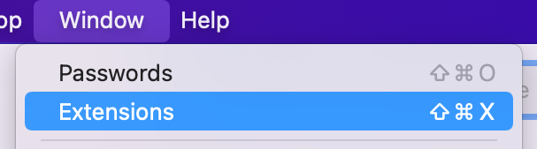

# Orion macOS Web Extensions Support

You will find here: 

- [Chrome and Firefox Extensions Support](#chrome_and_firefox)
- [Installing Popular Extensions](#installing_extensions)
- [Managing Extensions](#managing_extensions)
  - [Compatibility Mode](#compatibility_mode)
- [Enabling 3rd party Extension installation](#enable_installation)
   - [Choosing a Chrome Extension or a Firefox Extension](#chrome_vs_firefox)
- [Troubleshooting Extension issues](#troubleshooting)
- [Supported WebExtensions APIs](#supported_apis)
- [Manifest v2 vs. v3](#manifest)
- [Safari Extensions Support](#safari)

## Chrome and Firefox Extensions Support

Orion enables users to tap into over 300,000 extensions created both for the Chrome and Firefox browsers, and run them natively on top of WebKit rendering engine.

By adopting the WebExtensions APIs, we've shown our support for creating a unified browser extension experience across all three major web rendering engines. We've ended up porting hundreds of WebExtension APIs, one by one, that were never meant to work with WebKit. It took us a few years to do that and this is still work in progress. You can help this effort by [supporting Orion](https://browser.kagi.com/orionplus.html) development and becoming Orion+ member.

On top of that, we've built advanced security features that give our users granular control over extensions, far beyond what Chrome and Firefox offer. For example, you can choose to allow an extension to run only on certain websites.

Orion support for WebExtensions APIs is [currently at about 70%](#supported_apis). This means that many extensions will work but also that many are not fully supported. When an extension does not work in Orion, it is likely not a bug, but we did not support all the APIs it needs to run on WebKit yet. It is enough that one API is not supported for the extension to not work. Our goal is to have 100% extension support by the time Orion leaves beta. 
  
Note that while we designed Orion to be as fast and lightweight as possible, extensions may affect Orion's performance, which is out of our control. We advise limiting the number of extensions you use to only bare minimum required by your workflow. Orion includes many extension features natively, including a built in ad-blocker.

## Installing Popular Extensions

Orion highlights some popular Web Extensions for you to try first:

1. Click the **Orion** menu.
2. Choose **Popular Extensions**.
3. Click **Get** to install an extension.

 

## Managing Extensions

1. Click the **Window** menu.
2. Click **Extensions**.

  

3. From the **Extensions** management area, you can:
  - Use the **Add Extension** button to install Firefox, Chrome, or file-based extensions
  - Configure specific extensions
  - Disable one or more extensions
  - Uninstall one or more extensions
  
  

### Managing Extensions Permissions and Compatibility Mode

In Orion, you can manage extension permissisions on a per-website basis. 

Click the Gear icon in the toolbar to bring up website settings and look for "Extensions permissions" section. You can also manage extension permissions globally through Settings -> Websites menu (scroll down).

In addition, Orion features a simple to use [Compatibility mode](../support-and-community/troubleshooting-webpage-issues.md) option, which applies 'safe' settings for the current website, including disabling all extensions.
 
 

## Enabling 3rd party extension installation

To enable installation of 3rd party extension, go to **Settings -> Advanced** and find "Allow installation of 3rd party Chrome extensions" or "Allow installation of 3rd party Firefox extensions" options.

Note that the extension support is still in beta. Extension may not be fully supported yet and if you encounter problems, website issues or performance issues, you can easily uninstall it by right-clicking the extension icon and selecting 'Uninstall' or through the [manage extensions](#managing_extensions) window.

### Choosing a Chrome Extension or a Firefox Extension

Orion supports both Chrome and Firefox extensions. Usually, they’re similar. Sometimes, an extension developer puts extra effort into one version, perhaps because they prefer that browser. 

You can try both and use the one that works best for you. Orion is the only browser in the world that makes this choice possible!

## Installing Extensions

Many Chrome and Firefox extensions already work with Orion. And, even more of them will work in the future. 

 

You can install them directly from the [Chrome](https://chrome.google.com/webstore/category/extensions) or [Firefox](https://addons.mozilla.org/en-US/firefox/extensions/) extension websites with one click installation.

The most popular extensions can be installed from [Popular extensions](#popular_extensions) screen.

## Troubleshooting Web Extensions Issues

Sometimes Web Extensions will not work properly. Also Web Extensions are the most likely cause of performance or resource issues in Orion. If such issues occur, the safest is to uninstall the extension causing the issue. 

You can also submit a bug report to [Orion feedback forum](https://orionfeedback.org) and before that, check out our [troubleshooting web extensions guide](../support-and-community/troubleshooting-extension-issues.md) for more information.

## Supported WebExtensions APIs

Orion currently supports [about 70% of the WebExtensions APIs](https://browser.kagi.com/WebExtensions-API-Support.html), and we add support for more all the time.

## Manifest v2 vs. v3

The rollout of manifest v3 extensions in Chrome will not affect extensions in Orion.

Orion has its own implementation of the entire WebExtensions APIs collection. Different "manifests" are just numbers. We support WebExtensions APIs regardless of how Google decides to number them or change them. Manifest change impacts mainly Chromium clones. Orion will support both "manifest v2" and manifest v3" extensions in the future.

## Safari Extensions Support

Unfortunately, Apple uses closed, proprietary APIs for Safari extensions rather than open WebExtensions APIs. So, it is not possible to use Safari extensions with Orion or any non-Safari browser.
