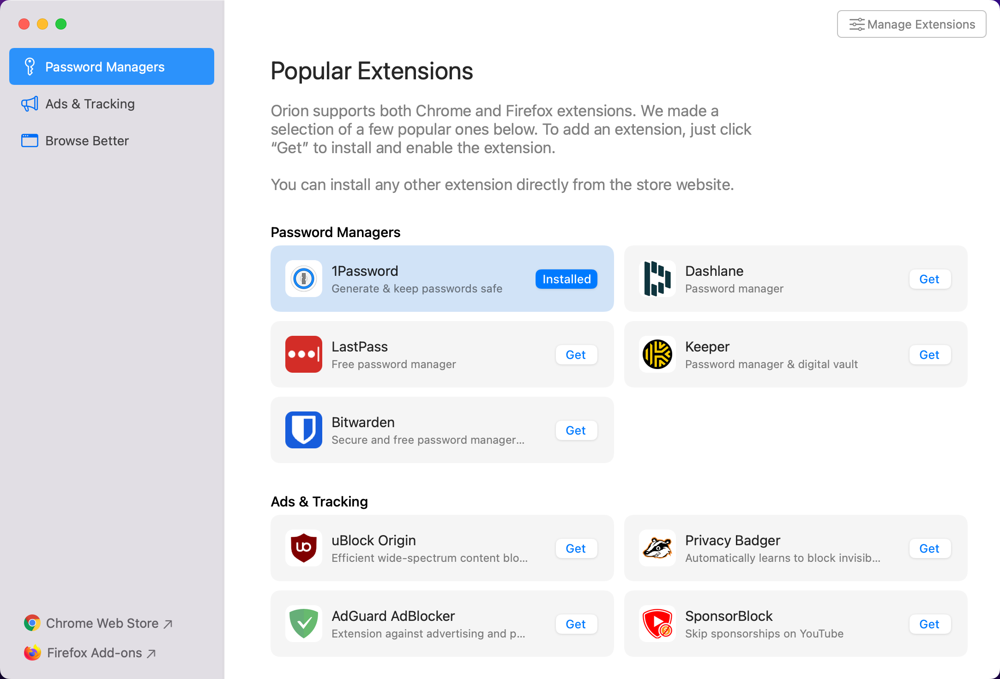
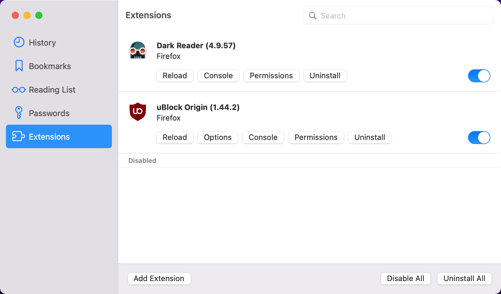

# macOS Extensions Support

## Table of Contents
- [Chrome and Firefox Extensions Support](#chrome_and_firefox)
- [Installing Extensions](#installing_extensions)
- [Choosing a Chrome Extension or a Firefox Extension](#chrome_vs_firefox)
- [Managing Extensions](#managing_extensions)
- [Safari Extensions Not Supported](#safari)
- [Manifest v2 vs. v3 Chrome Extensions](#manifest)

## Chrome and Firefox Extensions Support

 

Orion supports browser extensions based on open-standard WebExtensions APIs. These are the same APIs that power browser extensions for Chrome and Firefox.

Orion currently supports [about 70% of the WebExtensions APIs](https://browser.kagi.com/WebExtensions-API-Support.html), and we add support for more all the time.

If you're having a problem with an extension in Orion, you can file a bug report in our [feedback forum](https://orionfeedback.org).

On top of that, we've built advanced security features that give our users granular control over extensions, far beyond what Chrome and Firefox offer. For example, you can choose to allow an extension to run only on certain websites.

By adopting the WebExtensions APIs, we've shown our support for creating a unified browser extension experience across all three major web rendering engines. We've ended up porting hundreds of APIs, one by one, that were never meant to work with WebKit. It took us a few years, but here we are!
  
Note that extensions may affect Orion's performance. You can measure the impact of your extensions on Orion performance by running [SpeedoMeter 2.0](https://browserbench.org/Speedometer2.0/) browser benchmark, with and without extensions (using Compatibility mode option in Orion to disable all extensions).

## Installing Extensions

Many Chrome and Firefox extensions already work with Orion. And, even more of them will work in the future. You can install them from the [Chrome](https://chrome.google.com/webstore/category/extensions) or [Firefox](https://addons.mozilla.org/en-US/firefox/extensions/) extension websites.

Orion also highlights some popular extensions for you to try:

1. Click the **Orion** menu.
2. Choose **Popular Extensions**.

 

## Choosing a Chrome Extension or a Firefox Extension

Orion supports both Chrome and Firefox extensions. Usually, they’re similar. Sometimes, an extension developer puts extra effort into one version, perhaps because they prefer that browser. 

You can try both and use the one that works best for you. Orion is the only browser in the world that makes this choice possible!

## Managing Extensions

1. Click the **Window** menu.
2. Click **Extensions**.

  

3. From the **Extensions** management area, you can:
  - Use the **Add Extension** button to install Firefox, Chrome, or file-based extensions
  - Configure specific extensions
  - Disable one or more extensions
  - Uninstall one or more extensions
  
  

## Safari Extensions Not Supported

Unfortunately, Apple uses closed, proprietary APIs for Safari extensions rather than WebExtensions APIs. So, it is not possible to use Safari extensions with Orion or any non-Safari browser.

## Manifest v2 vs. v3 Chrome Extensions

The rollout of manifest v3 extensions in Chrome will not affect extensions in Orion.

Orion has its own implementation of the entire WebExtensions APIs collection. Different "manifests" are just numbers. We support WebExtensions APIs regardless of how Google decides to number them or change them. Manifest change impacts mainly Chromium clones. Orion will support both "manifest v2" and manifest v3" extensions in the future.