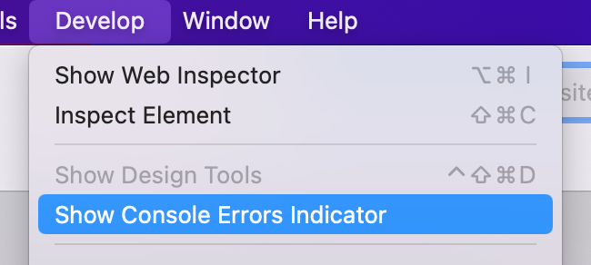

# Show Console Errors

This one's for the web developers out there. You can add an indicator to the address bar of Orion for macOS that shows the number of errors on the page. This error indicator will allow you to quickly open Console and inspect the errors.

1. Click the **Develop** menu.
2. Click **Show Console Errors Indicator**.

 

 