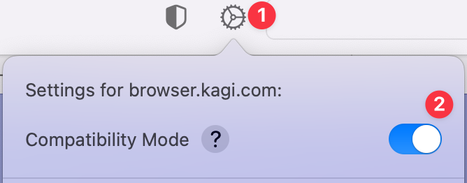
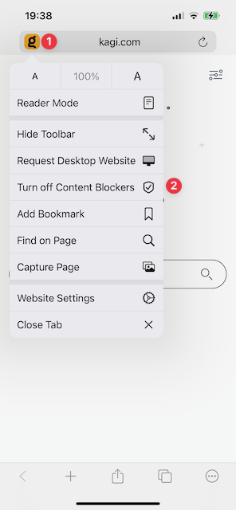
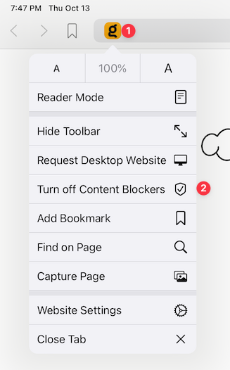

# Troubleshooting Webpage Issues

## Orion Compatibility Mode

If you're having an issue using a website on Orion for macOS, enabling Compatibility Mode for the website may resolve it.

Putting a website into Compatibility Mode will:

- Disable [content blocking](../privacy-and-security/protecting-privacy.md)
- Disable [tracking prevention](../privacy-and-security/protecting-privacy.md)
- Disable [web fonts](https://www.howtogeek.com/730585/what-is-a-web-font/) blocking
- Enable [cookies](https://en.wikipedia.org/wiki/HTTP_cookie)
- Use the Safari [user agent](https://developer.mozilla.org/en-US/docs/Web/HTTP/Headers/User-Agent) 
- Disable all browser extensions

To put a website into Compatibility Mode, use the gear icon on Orion's toolbar:

 

The gear icon also allows you to access other [Website Settings](../features/website-settings.md) that allow more granular control when troubleshooting.

## Empty Cache

If you encounter sluggish loading of web pages and/or switching tabs, try Develop menu -> Empty Cache.

## iOS & iPadOS

iOS and iPadOS don't have the Compatibility Mode feature. But, you can disable [content blockers](../privacy-and-security/ad-tracking-blocking.md) for specific websites where they cause problems.

You just tap on the icon for a website in the address bar and then tap **Turn off Content Blockers**.

### iOS

 

### iPadOS

 
